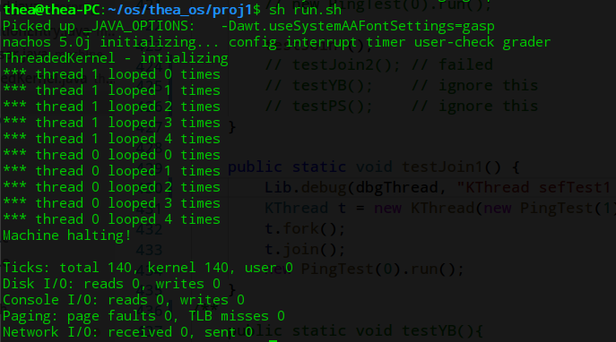
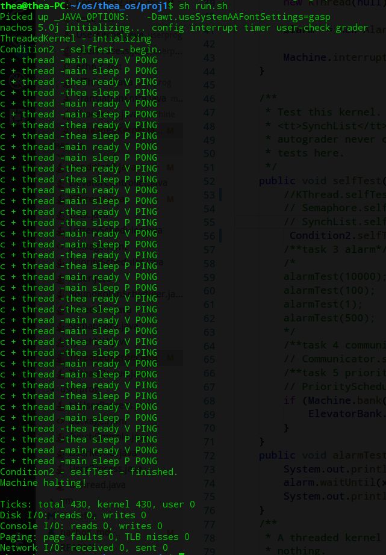
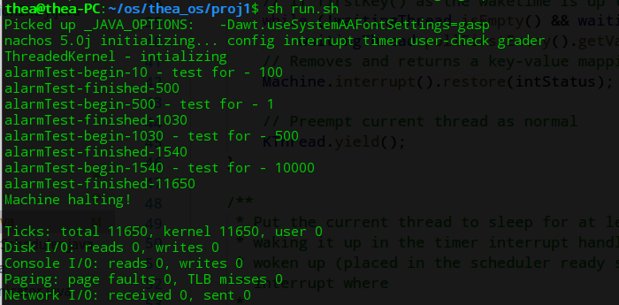
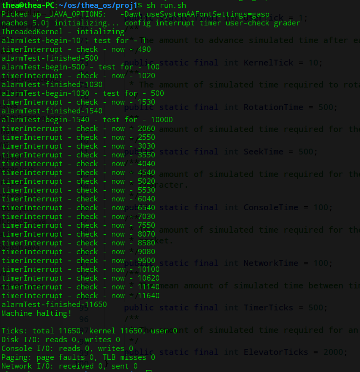
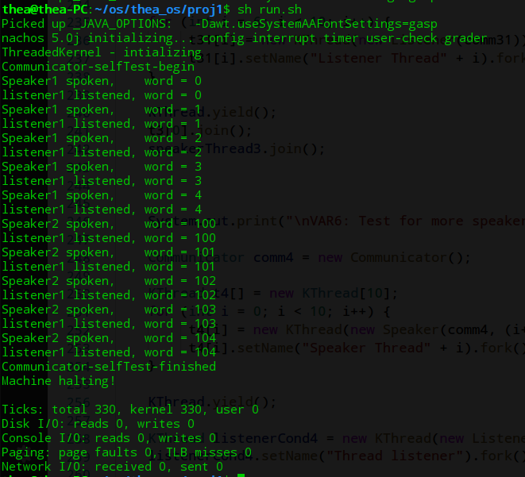
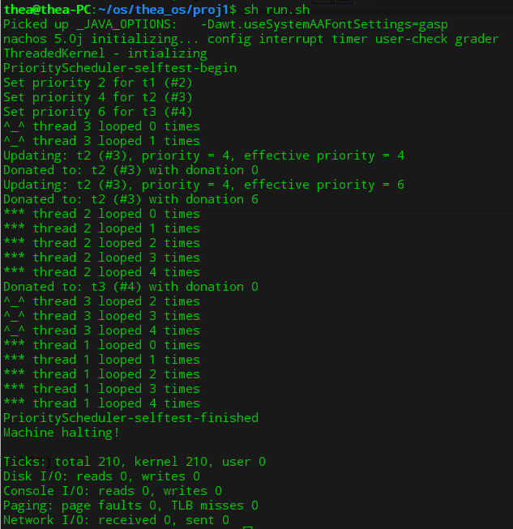

# nachos 

edit - 10.11

### proj1 

#### 下载和配置

下载解压到自定义的文件目录；

下载 jdk ;

下载　MIPS Cross-compilers　并配置环境便量

测试是否配置好，在　nachos/proj1 目录下输入　java nachos.machine.Machine $*

<!--由于配置nachos失败，直接执行上述操作启动程序-->

### 阅读向导和源码

<!--阅读源码的部分比较长，分解到各个项目中-->

- what is Nachos?

  - Nachos 是一个教学用的操作系统，包括一个真实的操作系统的许多方面，线程，中断系统，虚拟内存，由中断驱动的I/O，网络接口，计时器，MIPS处理器等．
  - 基于Java实现的Nachos在JVM之上，模拟了一个计算机的硬件系统包括CPU、中断控制器、定时器、网卡、内存、文件系统等. 然后模拟了一个在这些硬件之上运行的操作系统
  - An instructional operating system
  - includes many facets of a real OS:
    - Threads
    - Interrupts
    - Virtual Memory
    - I/O driven by interrupts
  - Contains some hardware simulation
    - MIPS processor
      - Can handle MIPS code in standard COFF, except for floating point instructions
    - Console
    - Network interface
    - TImer

- History of Nachos

  - Originally created at Berkeley in 1992 in C++ By Wayne A. Christopher, Steven J. Procter, and Tomas E. Anderson
  - Rewritten in Java by Daniel Hettena

- How does Nachos work?

  - 启动过程：　启动nachos.machine.Machine.main, Machine.main 初始化设备：中断控制器，计时器，MIPS处理器，控制台，文件系统．然后把控制权交给autograder. AutoGrader 会创建一个内核，并启动它．TCB(线程控制块)

  - ```java
    // nachos.machine.Machine.main
    processArgs(); //　处理nachos的命令行参数
    Config.load(nachos.confg) //configFileName是目录proj1, 或proj2 中的配置文件nachos.conf 
      // 读nachos.conf 的内容到名为machine.Config类创建的hash表中，供createDevices()使用
    createDevices() //　根据Config.load(configFileName)中读入的nachos.conf的参数构造相应的模拟设备
    checkUserClasses() //利用java类的反射(reflection)机制检查相应类及方法的完整性
      // 类似于操作系统加载时对要加载的模块进行检查
    new TCB().start(new Runnable() {
        	    public void run() { autoGrader.start(privilege); }
        	});
    ```

  - ```java
    //autoGrader.start()
    kernel = (Kernel) Lib.constructObject(Config.getString("Kernel.kernel"));
    kernel.initialize(args);　//初始化Ｎachos,创建就绪队列，创建主线程及idle
    run();
    //**************************************************************************
    void run() {
      kernel.selfTest();
      kernel.run();
      kernel.terminate();
    }
    ```

  - 对于proj1 Kernel.kernel = nachos.threads.ThreadedKernel

  - 所以我们可以把测试代码写在 ThreadedKernel 的 selfTest() 里面

  - 对于proj2 可以在ＵserKernel 的 selfTest()里面写测试

  - ```java
    #// nachos.conf -- proj2
    Machine.stubFileSystem = true
    Machine.processor = true
    Machine.console = true
    Machine.disk = false
    Machine.bank = false
    Machine.networkLink = false
    Processor.usingTLB = false
    Processor.numPhysPages = 64
    ElevatorBank.allowElevatorGUI = false
    NachosSecurityManager.fullySecure = false
    ThreadedKernel.scheduler = nachos.threads.LotteryScheduler  #nachos.threads.RoundRobinScheduler #
    Kernel.shellProgram = sh.coff #halt.coff
    Kernel.processClassName = nachos.userprog.UserProcess
    Kernel.kernel = nachos.userprog.UserKernel
    ```

  - When you run Nachos, it starts in nachos.machine.Machine.main

  - Machine.main initializes devices - interrupt controller, timer, MIPS processor, console, file system

  - Passes control to the autograder.

  - AutoGrader will create a kernel and start it (this starts the OS)

- **Machine** 

  - 启动系统，并提供对各种硬件设备的访问
  - nachos.machine.Machine
  - Kicks off the system, and provides access to various hardware devices:
    - Machine.interrupt()
    - Machine.timer()
    - Machine.console()
    - Machine.networkLInk()

- **Interrupt Controller**

  - 启动硬件中断，管理一个事件队列
  - 时钟：　one tick 执行MIPS指令　10 ticks 重新启用中断
  - 每个tick之后，中断控制器检查待处理的中断，并运行它们
  - 调用设备事件处理器，而不是软件中断处理程序
  - 所有的硬件设备都依赖于中断，它们没有单独的线程
  - Kicks off hardware interrupts
  - nachos.machine.Interrupts class
    - maintains an event queue, clock
  - Clock ticks under two conditions:
    - One tick for executing a MIPS instruction
    - Ten ticks for re-enabling interrupts
  - After any tick, Interrupt checks for pending interrupts, and runs them
  - Calls device event handler, not software interrupt handler
  - Important methods, accessible to other hardware simulation devices:
    - scheduler() takes a time, handler
    - tick() takes a boolean(1 or 10 ticks)
    - checkIfDue() invokes due interrupts
    - enable()
    - disable()
  - All hardware devices depend on interrupts - **they don't get threads**

- **Timer**

  - 硬件设备约每 500 ticks 引起中断
  - 提供抢占操作
  - nachos.machine.TImer
  - Hardware device causes interrupts about every 500 ticks (not exact)
  - Important methods:
    - getTImer() tells many ticks so far
    - setInterruptHandler() tells the timer what to do when it goes off
  - Provides preemption (抢占)

- **Serial Console**

  - 控制台　接口　读写字符
  - StadardConsole 实现 SerialConsole 的接口，
  - Java interface nachos.machine.SerialConsole
  - Contains methods:
    - readByte() return one byte (or -1) and waits to interrupts when it has more
    - writeByte() takes one byte and waits to interrupt when its ready for more
    - setInterruptHandlers() tells the consoloe who to call when it receives data or finishes sending data
  - Normally implemented by nachos.machine.StandardConsole , hooked up to stdin and stdout

- **The Kernel**

  - Abstract class nachos.machine.Kernel
  - Important methods
    - initialize() initializes the kernel
    - selfTest() performs test (not used by ag)
    - run() runs any user code (none for 1st phase)
    - terminate() Game over. Never returns. hhh
  - Each Phase will have its own Kernel subclass

- **Threading**

  - nachos.threads
  - All Nachos threads are instances of nachos.thread.KThread (or subclass)
  - KThread has status
    - New, Ready, Running, Blocked, Finished
  - Every KThread also has a nachos.machine.TCB
  - Internally implemented by Java threads

- Scheduler

  - some subclass of nachos.machine.Scheduler
  - Create ThreadQueue objects which decide what thread to run next

- Nachos Configuraion

  - nachos.conf file lets you specify many options
    - which class to use for Kernel, Scheduler
    - whether to be able to run user progs

- userprog

  - UserProcess
    - 一个Kthread对象对应一个Ｎachos核心线程
    - 一个ＵserProcess对象对应一个Nachos用户进程
    - 一个Uthread对象对应一个Ｎachos用户线程
    - UserProcess实现将用户程序从文件系统加载到该用户进程，并在进程中创建一个用户线程以执行用户程序的代码
    - 同时为用户提供系统调用等服务
    - machine.Processor类模拟了nachos的CPU,以及CPU执行MIPS指令的过程

- File system

  - machine/FileSystem.java  
    - file system
  - machine/OpenFile.java
    - a nachos file(opened), 类似于java的File
  - machine/StubFileSystem.java
    - 对OpenFile, FileSystem 方法的具体实现
    - 文件的open() 是基于java的RandomAccessFile实现的，其余的read, write, close等都是基于java的File类实现的．
  - machine/StandardConsole.java
    - 利用java的System.in与System.out模拟了一个nachos控制台，模拟系统的键盘输入和文本输出

- Nachos Command line Arguments

  - -d <debug flags> 
    - enable some debug flags, e.g. -d ti
    - c: prints process loading information (COFF)
    - i: HW interrupt controller info
    - p: processor info
    - m: MIPS disassembly
    - M: more MIPS disassembly
    - t: thread info
    - a: process info
  - -h
    - print this help message
  - -m <pages>
    - Specify how many physical pages of memory to simulate
  - -s <seed>
    - Specify the seed for the random number generator
  - -z
    - print the copyright message
  - -x <program>
    - Specify a program that UserKernel.run() should execute, instead of the value of the configuration variable Kernel.shellProgram

- Nachos 线程

  - 一个KThread对象代表一个Nachos线程
    - 线程的创建KThread.fork()
    - 线程的就绪KThread.ready()
    - 线程的睡眠KThread.sleep()
    - 线程的状态与转换
    - 线程的上下文切换
  - 一个Ｎachos线程由三部分组成
    - 一个KThread对象
    - 与KThread 对象对应的TCB对象
    - 与TCB对象绑定的JAVA线程
  - 约束关系
    - KThread.tcb -> TCB.javaThread->java Thread (new Thread(new Runnable))
    - 线程的上述操作是在KThread对应的TCB中，通过java的相应操作具体实现的
    - ​

### 程序的题目要求分析及解答

<!--为避免出现乱码，程序采用英文注释，在此文件中将添加一些中文解释-->

> The first step is to read and understand the partial thread system we have written for you. This thread system implements thread fork, thread completion, and semaphores for synchronization. It also provides locks and condition variables built on top of semaphores.
>
> 第一步是阅读和理解我们为你写的部分线程系统。 这个线程系统实现了线程分叉，线程完成和信号量的同步。 它还提供了基于信号量构建的锁和条件变量。

1. > (5%, 5 lines) Implement `KThread.join()`. Note that another thread does not have to call `join()`, but if it is called, it must be called only once. The result of calling `join()` a second time on the same thread is undefined, even if the second caller is a different thread than the first caller. A thread must finish executing normally whether or not it is joined.
   >
   > (5％）实现`KThread.join()`。 请注意，另一个线程不是必须调用join（），但是如果它被调用，它只能被调用一次。 即使第二个调用方是与第一个调用方不同的线程，第二个调用join（）的结果也是未定义的。 无论是否被join，一个线程都必须正常执行。

   - 题目分析：

     - t.join()的作用是等待调用此方法的线程(t)执行完(Wait for this thread to die)．
     - join()函数只能被调用一次，第二次调用未定义．
     - join()结束时唤醒在等待队列中的所有线程

   - 方法及代码：

     - 修改finish()

       ```java
       public static void finish() {
               Lib.debug(dbgThread, "Finishing thread: " + currentThread.toString());
               Machine.interrupt().disable();
               //---------------------------------------------------------------------
               // when currentThread finished, threads of its joinQueue start execute 
               ThreadQueue currentJoinQueue = currentThread.joinQueue; 
               if(currentJoinQueue != null) {
                   KThread thread = currentJoinQueue.nextThread();
                   while(thread!=null) {
                       thread.ready(); // 唤醒等待队列上所有被阻塞的线程
                       thread = currentJoinQueue.nextThread();
                   }
               }
               //---------------------------------------------------------------------
               Machine.autoGrader().finishingCurrentThread();
               Lib.assertTrue(toBeDestroyed == null);
               toBeDestroyed = currentThread;
               currentThread.status = statusFinished;
               sleep(); //终止的线程睡眠，等待撤销；同时引起线程调度
           }
       ```

     - 修改join()

       ```java
       public void join() {
               Lib.debug(dbgThread, "Joining to thread: " + toString());
               Lib.assertTrue(this != currentThread);
         //---------------------------------------------------------------------------
               boolean intStatus = Machine.interrupt().disable();//系统关中断
               if(this.joinQueue == null) {
                   this.joinQueue = ThreadedKernel.scheduler.newThreadQueue(false);
                   this.joinQueue.acquire(this);
               }
               if(currentThread != this && status != statusFinished) {
                   this.joinQueue.waitForAccess(currentThread);
                   currentThread.sleep();//当前线程等待被调用线程结束
               }
               Machine.interrupt().restore(intStatus);
         //---------------------------------------------------------------------------
           }
       ```

     - 测试selfTest()

       ```java
       public static void testJoin1() {
               Lib.debug(dbgThread, "KThread sefTest1 start");
               KThread t = new KThread(new PingTest(1)).setName("t");
               t.fork();
               t.join();
               new PingTest(0).run();
           }
       ```

       

          如上图结果所示，main线程等待t线程执行完之后再执行，完成了 t.join().

2. > (5%, 20 lines) Implement condition variables directly, by using interrupt enable and disable to provide atomicity. We have provided a sample implementation that uses semaphores; your job is to provide an equivalent implementation without directly using semaphores (you may of course still use locks, even though they indirectly use semaphores). Once you are done, you will have two alternative implementations that provide the exact same functionality. Your second implementation of condition variables must reside in class `nachos.threads.Condition2`.
   >
   > 直接实现条件变量，通过使用中断启用和禁用来提供原子性。 我们提供了一个使用信号量的示例实现; 你的工作是提供一个没有直接使用信号量的等价的实现（你当然可以使用锁，即使它们间接使用信号量）。 一旦你完成了，你将有两个可供选择的实现提供完全相同的功能。 条件变量的第二个实现必须驻留在类nachos.threads.Condition2中。

   - 题目分析

     - 条件变量(Condition) 为一个线程暂停执行提供了一种方法，直到直到另一个线程通知现在某些状态条件成立为止．由于对共享状态信息的访问发生在不同的线程中，因此必须对其进行保护，以便某种形式的锁与条件相关联．它会自动释放关联的锁并暂停当前线程．

   - 方法及代码

     - 变量声明

       ```java
       private int value;
       private String name;
       private Lock conditionLock;
       private ThreadQueue waitQueue =  ThreadedKernel.scheduler.newThreadQueue(false);
       private LinkedList<Condition2> waitQueue_1;
       ```

     - sleep() - 在条件变量控制下，sleep()自动释放

       ```java
       public void sleep() {
               Lib.assertTrue(conditionLock.isHeldByCurrentThread());
               
               //　添加到等待队列
               Lock lock1 = new Lock();
               Condition2 waiter = new Condition2(lock1);
               waitQueue_1.add(waiter);

               conditionLock.release();
               waiter.P();　// 调用KThread.sleep()使当前线程睡眠
               conditionLock.acquire();
           }
       ```

     - wake() - 唤醒等待队列中第一个线程

       ```java
       public void wake() {
               Lib.assertTrue(conditionLock.isHeldByCurrentThread());
               if (!waitQueue_1.isEmpty())
                   (waitQueue_1.removeFirst()).V();
       }
       ```

     - wakeAll() - 调用wake()，唤醒等待队列中所有的线程

       ```java
        public void wakeAll() {
               Lib.assertTrue(conditionLock.isHeldByCurrentThread());
               while (!waitQueue_1.isEmpty())
                   wake();
        }
       ```

     - P() - 使当前线程睡眠

       ```java
        public void P() {
               boolean intStatus = Machine.interrupt().disable();
               //　使当前线程睡眠
               if (value == 0) {
                   waitQueue.waitForAccess(KThread.currentThread());
                   KThread.sleep();
                   System.out.println("c + thread -" + KThread.currentThread().getName() +" sleep P " + this.getSName());
               }
               else {
                   value--;
               }

               Machine.interrupt().restore(intStatus);
           }
       ```

       ​

     - V() - 将等待队列中的线程加入就绪队列

       ```java
        public void V() {
               boolean intStatus = Machine.interrupt().disable();
               //将等待队列中的线程加入就绪队列
               KThread thread = waitQueue.nextThread();
               if (thread != null) {
                   thread.ready();
                   System.out.println("c + thread -" + thread.getName() + " ready V " + this.getSName());
               }
               else {
                   value++;
               }
               
               Machine.interrupt().restore(intStatus);
           }
       ```

       ​

     - PingTest() - 该方法是为了便于测试

       ```java
       private static class PingTest implements Runnable {
       		PingTest(Condition2 ping, Condition2 pong) {
       			this.ping = ping; this.ping.setSName("PING");
       			this.pong = pong; this.pong.setSName("PONG");
       		}

       		public void run() {
       			for (int i=0; i<10; i++) {
       				ping.P();　// sleep
       				pong.V();  // ready 
       			}
       		}

       		private Condition2 ping;
       		private Condition2 pong;
           }
       ```

     - selfTest()

       ```java
       public static void selfTest() {
               System.out.println("Condition2 - selfTest - begin.");
               
               Lock lock1 = new Lock();
               Lock lock2 = new Lock();
       		Condition2 ping = new Condition2(lock1);
       		Condition2 pong = new Condition2(lock2);

       		new KThread(new PingTest(ping, pong)).setName("thea").fork();
       		
       		// main ready 
       		// main sleep
       		for (int i=0; i<10; i++) {
       			ping.V(); // ready
       			pong.P(); // sleep
       		}

       		System.out.println("Condition2 - selfTest - finished.");
           }
       ```

       ​

   - 测试及结果

     

   ​

3. (10%, 40 lines)

   -  Complete the implementation of the `Alarm` class, by implementing the `waitUntil(long x)` method. 通过waitUntil(long x)实现Ａlarm类．
   -  A thread calls `waitUntil` to suspend its own execution until time has advanced to **at least now + x**.一个线程通过调用 waitUntil(long x)方法将自己挂起，一直到经过 x 时间再被唤醒。
   -  This is useful for threads that operate in real-time, for example, for blinking the cursor once per second. 
   -  There is no requirement that threads start running immediately after waking up; just put them on the ready queue *in the timer interrupt handler* after they have waited for at least the right amount of time. 线程经过至少x 时间后唤醒，但不需要立刻运行，而是加入 readyqueue 中。
   -  Do not fork any additional threads to implement `waitUntil()`; **you need only modify `waitUntil()` and the timer interrupt handler.**  
   -  `waitUntil` is not limited to one thread; **any number of threads** may call it and be suspended at any one time.      <u>put a waiting queue in this class</u>　waitUntil()　不受限于任何一个线程，
      任何线程可以调用它实现被挂起。

   > 参考：
   >
   > - https://github.com/viturena/nachos/blob/master/threads/Alarm.java
   > - https://www.javatpoint.com/java-treemap

   - 题目分析
     - Alarm 类使用硬件定时器提供抢占，并允许线程挂起到某个时间．
     - 定时器中断处理程序被成为机器计时器定期(大约每500时钟周期).
     - 当前线程睡眠至少x时间周期，在定时器中断处理程序中将其唤醒．当现在时间(current times) >= (WaitUntil called time) + (x)时, 线程必须被唤醒（在中断产生时)．因为waitUntil()是至少x时间后唤醒，所以只需要满足睡眠时间大于x即可． 


   - 方法及代码

     - timerInterrupt() - 睡眠唤醒的实现．中断发生时，遍历waitingThread, 如果有线程的等待时间达到，将该线程放入就绪队列．

       ```java
       public void timerInterrupt() {
               boolean intStatus = Machine.interrupt().disable();
               
               long current = Machine.timer().getTime();
               // check the key
               // it requests at least x time so this counts
               // if firstKey() as the waketime is up then get ready
               while (!waitingThread.isEmpty() && waitingThread.firstKey() <= current)
                   waitingThread.pollFirstEntry().getValue().ready();
               // Removes and returns a key-value mapping associated with the least key in this map, or null if the map is empty.
               Machine.interrupt().restore(intStatus);

               // Preempt current thread as normal
               KThread.yield();
           }
       ```

     - waitUntil()

       ```java
        public void waitUntil(long x) {
               // for now, cheat just to get something working (busy waiting is bad)
               boolean intStatus = Machine.interrupt().disable();
               long wakeTime = Machine.timer().getTime() + x;
               // Place current thread on a wait queue and put it to sleep
               waitingThread.put(wakeTime, KThread.currentThread());
               KThread.sleep();
               Machine.interrupt().restore(intStatus);
           }
       ```

     - 测试alarmTest()

       ```java
        public void alarmTest(long x) {
               System.out.println("alarmTest-begin-"+Machine.timer().getTime()+" - test for - "+x);
               alarm.waitUntil(x);
               System.out.println("alarmTest-finished-"+Machine.timer().getTime());
           }
       ```

   - 测试结果

     

     alarmTest开始的时候时钟周期是10,　可能是因为kernelTick=10

     

     timerInterrupt 约每隔500个时钟周期产生一次，多出来的时间可能是kernelTick

4. (20%, 40 lines)

   -  Implement synchronous send and receive of one word messages 
     - using condition variables (don't use semaphores!). 
   -  Implement the Communicator class with operations, void speak(int word) and int listen().`speak()` atomically waits until `listen()` is called on the same `Communicator` object, and then transfers the word over to `listen()`. Once the transfer is made, both can return. Similarly, `listen()` waits until `speak()` is called, at which point the transfer is made, and both can return (`listen()` returns the word). This means that **neither thread may return from `listen()` or `speak()` until the word transfer has been made. **
   -  Your solution should work even if there are multiple `speak`ers and `listen`ers for the same `Communicator` (note: this is equivalent to a zero-length bounded buffer; since the buffer has no room, the producer and consumer must interact directly, requiring that they wait for one another). Each communicator should only use exactly **one** lock. If you're using more than one lock, you're making things too complicated.

   > 参考：[deep_keng](http://blog.csdn.net/deep_kang/article/category/6570538)

   - 题目分析

     - 使用条件变量(Condition)实现信息的发送和接收
     - 信息在线程之间传递以后，返回listen() 或者 speak()
     - 对于同一个Communicator可以有多个speaker和listener．

   - 方法及代码

     - 变量定义

       ```java
          Lock lock; //只使用一个锁
          private int speakerNum;　//歌者的个数
          private int listenerNum;　//听者的个数    
          private LinkedList<Integer> words;//传递消息的链表  
          Condition listener;//　听者的条件变量
          Condition speaker;//　歌者的条件变量
       ```

     - speak()

       ```java
        public void speak(int word) {
               // disable interrupt
               boolean preStatus = Machine.interrupt().disable();
               
               // acuquire lock
               lock.acquire();
               // add a speaker
               speakerNum++;

               while (!words.isEmpty() || listenerNum == 0)
                   speaker.sleep();
               // speaker says a word
               words.addLast(word);
              
               // wake up all listeners
               listener.wakeAll();

               speakerNum--;
               
               lock.release();

               Machine.interrupt().restore(preStatus);
        }
       ```

     - listen()

       ```java
       public int listen() {

               boolean preStatus = Machine.interrupt().disable();

               lock.acquire();
               // increase the number of listener by one
               listenerNum++;
               while (words.isEmpty()) {
                   speaker.wakeAll();
                   listener.sleep();
               }
               // listener receives the word
               int word = words.removeFirst();
        
               // decrease listener number
               listenerNum--;

               lock.release();
               
               Machine.interrupt().restore(preStatus);
               
               // return words.removeLast();
       	    return word;
           }
       ```

     - Speaker 自定义类

       ```java
       private static class Speaker implements Runnable {

               private Communicator c;
               private int base = 0; //基量－用来区分不同的歌者
               
               Speaker (Communicator c, int base) {
                   this.c = c;
                   this.base = base;
               }
               
               public void run() {
                   for (int i = base; i < 5+base; ++i) {
                       c.speak(i);
                       System.out.println(KThread.currentThread().getName() + " spoken,    word = " + i);
         
                   }
               }
           }
       ```

     - Listener　自定义类

       ```java
       private static class Listener implements Runnable {
               Listener(Communicator c) {
                   this.c = c;
               }
               public void run() {
                   for (int i = 0; i < 10; ++i) {
                       int word = c.listen();
                       System.out.println(KThread.currentThread().getName() + " listened, word = " + word);
                   }
               }
               private Communicator c;
           }
       ```

       ​

     - 测试selfTest()

       ```java
       public static void selfTest() {
               System.out.println("Communicator-selfTest-begin");
               
               Communicator c = new Communicator();
              
               // fork a new thread to speak
               KThread speaker1 = new KThread(new Speaker(c, 0));
               speaker1.setName("Speaker1").fork();
               // KThread.yield();
               KThread speaker2 = new KThread(new Speaker(c, 100));
               speaker2.setName("Speaker2").fork();
               // KThread.yield();
               KThread listener1 = new KThread(new Listener(c));
               listener1.setName("listener1").fork();
             
               // KThread.yield();
               listener1.join();
               speaker1.join();
               speaker2.join();
             
               System.out.println("Communicator-selfTest-finished");
           }
       ```

       ​

   - 测试结果

     - 一个听者两个歌者(base = 0 | base = 100)

     

5. (35%, 125 lines)

   - Implement priority scheduling in Nachos by completing the PriorityScheduler class. 
     - Priority scheduling is a key building block in real-time systems.

     - Note that in order to use your priority scheduler, you will need to change a line in nachos.conf  that specifies the scheduler class to use. The ThreadedKernel.scheduler  key is initially equal to achos.threads.RoundRobinScheduler. You need to change this to nachos.threads.PriorityScheduler  when you're ready to run Nachos with priority scheduling.

     - Note that all scheduler classes extend the abstract class `nachos.threads.Scheduler`.

     - You must implement the methods `getPriority()`, `getEffectivePriority()`, and `setPriority()`. 

     - You may optionally also implement `increasePriority()` and `decreasePriority()` (these are not required).

     - In choosing which thread to dequeue, the scheduler should always choose a thread of the highest effective priority. If multiple threads with the same highest priority are waiting, the scheduler should choose the one that has been waiting in the queue the longest.

       在选择哪个线程出队时，调度器应该总是选择一个最高有效优先级的线程。 如果具有相同最高优先级的多个线程正在等待，那么调度器应该选择在队列中最长等待的那个线程。
   - An issue with priority scheduling is *priority inversion*.
     -  If a high priority thread needs to wait for a low priority thread (for instance, for a lock held by a low priority thread), and another high priority thread is on the ready list, then the high priority thread will never get the CPU because the low priority thread will not get any CPU time.

        如果高优先级线程需要等待低优先级线程（例如，对于低优先级线程所持有的锁），并且另一个高优先级线程在就绪列表中，则高优先级线程将永远不会获得CPU，因为 低优先级的线程将不会获得任何CPU时间。

     -  A partial fix for this problem is to have the waiting thread *donate* its priority to the low priority thread while it is holding the lock.

        这个问题的一个部分解决方案是让等待线程在持有锁的同时将其优先级捐赠给低优先级线程。

     -  Implement the priority scheduler so that it donates priority, where possible. Be sure to implement `Scheduler.getEffectivePriority()`, which returns the priority of a thread after taking into account all the donations it is receiving.

        实施优先级调度程序，以便在可能的情况下提供优先级。 一定要实现`Scheduler.getEffectivePriority()`，它在考虑了所有正在接收的捐赠之后返回一个线程的优先级。

     -  Note that while solving the priority donation problem, you will find a point where you can easily calculate the effective priority for a thread, but this calculation takes a long time. To receive full credit for the design aspect of this project, you need to speed this up by caching the effective priority and only recalculating a thread's effective priority when it is possible for it to change.

        请注意，在解决优先捐赠问题的同时，您会发现一个点，您可以轻松计算线程的有效优先级，但是这个计算需要很长时间。 要获得本项目设计方面的全部分数，您需要通过缓存有效优先级来加快速度，只有在有可能更改时才重新计算线程的有效优先级。

     -  It is important that you do not break the abstraction barriers while doing this part -- the Lock class does not need to be modified. Priority donation should be accomplished by creating a subclass of ThreadQueue that will accomplish priority donation when used with the existing Lock class, and still work correctly when used with the existing Semaphore and Condition classes. Priority should also be donated through thread joins.

        在做这部分时，不要打破抽象障碍是很重要的，Lock类不需要修改。 优先级捐赠应该通过创建一个ThreadQueue的子类来完成，当与现有的Lock类一起使用时，它将完成优先捐赠，并且在与现有的Semaphore和Condition类一起使用时仍然可以正常工作。 优先级也应该通过线程连接来提供。

   > Priority Donation Implementation Details:
   >
   > 1) A thread's effective priority is calculated by taking the max of the donor's and the recipient's priority. If thread A with priority 4 donates to thread B with priority 2, then thread B's effective priority is now 4. Note that thread A's priority is also still 4. A thread that donates priority to another thread does not lose any of its own priority. For these reasons, the term "priority inheritance" is in many ways a more appropriate name than the term "priority donation".
   >
   > 2) Priority donation is transitive. If thread A donates to thread B and then thread B donates to thread C, thread B will be donating its new effective priority (which it received from thread A) to thread C.
   >
   > 优先捐赠实施细节：
   >
   > 1）一个线程的有效优先级是根据捐助者的最大值和接收者的优先级来计算的。 如果优先级为4的线程A向优先级为2的线程B进行捐赠，则线程B的有效优先级为4.请注意，线程A的优先级依然为4.向另一个线程赋予优先级的线程不会失去任何优先级。 由于这些原因，“优先继承”这个词在很多方面比“优先捐赠”这个词更加合适2）优先捐赠是传递性的。 如果线程A捐赠给线程B，然后线程B捐赠给线程C，则线程B将向线程C捐赠其新的有效优先级(从线程A收到的）。

   - 题目分析

     - 为解决优先级反转问题，需要实现一种＂捐赠＂优先级机制(Priority Donation, 说是Priority Inheritance更合适).
     - `getEffectivePriority()`就是为了解决 *priority inversion* 设置的，也就是说当出现一个优先级高的线程等待低优先级线程时，若存在另外的高优先级线程而导致低优先级线程永远不能执行的情况，该低优先级线程调用该函数返回它持有的锁上等待的所有线程中优先级中最高的一个赋给该低优先级,　以确保它执行．
     - `PriorityThreadQueue`类继承自`ThreadQueue`类，作用是按照优先级给线程排序
     - 定义`ThreadState`类, 它存储一个线程的优先级，有效优先级，等待时间和等待队列．并提供计算有效优先级的方法．

   - 方法及代码

     修改`PriorityScheduler.java`

     - 变量定义

       ```java
       //　定义默认优先级，优先级下限和优先级上限
       public static final int priorityDefault = 1;
       public static final int priorityMinimum = 0;
       public static final int priorityMaximum = 7; 
       ```

     - 内部类 - `ThreadState`

       - 变量定义

         ```java
         // 与该对象关联的线程
         protected KThread thread;
         //　线程的优先级
         protected int priority;
         //　线程的有效优先级
         protected EffectivePriorityDesc effectivePriority = new EffectivePriorityDesc(0);
         // 该线程需要等待的线程(只有parents先执行完，该线程才能执行)
         protected HashSet<PriorityQueue> parents = new HashSet<PriorityQueue>();
         ```

       - `waitForAccess()`

         ```java
         // 当前线程需要访问被waitQueue拥有的资源 
         public void waitForAccess(PriorityQueue waitQueue) {
              parents.add(waitQueue);
         }
         ```

       - `acquire()`

         ```java
         // 当等待队列里的线程被申请时，从等待队列中移除
         public void acquire(PriorityQueue waitQueue) {
          	parents.remove(waitQueue);
         }
         ```


       - `donatePriority()`

         ```java
          public void donatePriority(DonationController q, int donation) {
          	effectivePriority.donate(q, donation);
             notifyParents();
             System.out.println("Donated to: " + thread + " with donation " + donation);
          }
         ```

         ​

       - `retractDonatePriority()`

         ```java
         public void retractDonatedPriority(DonationController q) {         			    effectivePriority.retract(q);
            notifyParents();
          }
         ```

         ​

       - (内部类`ThreadState`的)内部类`EffectivePriorityDesc`

         - 存储捐赠者和计算最大捐赠值, 执行捐赠

         - 变量定义

           ```java
           protected int priority, max_donation; // 优先级，最大捐献值
           protected HashMap<PriorityScheduler.DonationController, Integer> donations = new HashMap<DonationController, Integer>();　// 捐献者
           ```

         - `donate()`

           ```java
           void donate(DonationController q, int priority) {
                this.donations.put(q, priority);
                max_donation = Math.max(max_donation, priority);
           }
           ```

         - `retract()`

           ```java
           void retract(DonationController q) {
                if(donations.containsKey(q)) {
                    int p = donations.get(q);
                    donations.remove(q);
                    if(max_donation == p) {
                        max_donation = 0;
                        for(Map.Entry<DonationController, Integer> e : donations.entrySet()) {
                             max_donation = Math.max(max_donation, e.getValue());
                         }
                     }
                 }
           }
           ```

       - 内部类 - `DonationController`

         - 变量声明

           ```java
           // 捐赠者
           protected ThreadState target;
           // 最大优先级
           protected int maximumPriority;
           //　
           protected java.util.PriorityQueue<PriorityQueue.ThreadWrapper> queue;
           ```

         - `setTarget()`

           ```java
           public void setTarget(ThreadState t) {
               if(target != null)
                    target.retractDonatedPriority(this);
               target = t;
               target.donatePriority(this, maximumPriority);
           }
           ```

         - `resetMaximumPriority()`

           ```java
           public void resetMaximumPriority(ThreadState t) {
                if(t.getEffectivePriority() == maximumPriority) {
                      maximumPriority = priorityMinimum;
                      for(PriorityQueue.ThreadWrapper w : queue)
                         maximumPriority = Math.max(maximumPriority, w.state.getEffectivePriority());
                 }
           }
           ```

         - `transferPriority()`

           ```java
           public void transferPriority(ThreadState t) {
                maximumPriority = Math.max(t.getEffectivePriority(), maximumPriority);
                if(target != null && maximumPriority > target.getEffectivePriority()) {
                     target.donatePriority(this, maximumPriority);
                }
            }
           ```

           ​

     - 内部类`PriorityQueue`

       根据优先级进行排序

       - 变量定义

         - ```java
           // 是否进行优先级传递
           public boolean transferPriority;
           // 优先级队列排序的ThreadWrapper
           public java.util.PriorityQueue<ThreadWrapper> queue = new java.util.PriorityQueue<ThreadWrapper>();
           // 绑定ThreadState和ThreadWrapper
           public HashMap<ThreadState, ThreadWrapper> threadStates = new HashMap<ThreadState, ThreadWrapper>();
           // 执行捐赠的操作的类
           public DonationController donationController;
           ```

         - 内部类 - `ThreadWrapper`

           封装了 `ThreadState`  和  `timeInserted` 两个属性

           实现 `Comparable` 接口, 可以比较大小

           - 变量定义

             ```java
             public ThreadState state;
             public long timeInserted;
             ```

           - `compareTo`

             ```java
             // 如果有效优先级一样，等待时间越长的线程越＂大＂;如果有效优先级不一样，优先级越大的线程越＂大＂
             public int compareTo(Object o) {
                  Lib.assertTrue(o instanceof ThreadWrapper);
                  ThreadWrapper s = (ThreadWrapper) o;
                  return (state.getEffectivePriority() == s.state.getEffectivePriority()) ? (int)(timeInserted - s.timeInserted) : (s.state.getEffectivePriority() - state.getEffectivePriority());
             }
             ```

       - `waitForAccess()`

         ```java
         public void waitForAccess(KThread thread) {
         	Lib.assertTrue(Machine.interrupt().disabled());
             Lib.assertTrue(!threadStates.containsKey(getThreadState(thread)));
             // 把线程添加进threadStates
             threadStates.put(getThreadState(thread), new ThreadWrapper(getThreadState(thread)));
             //　把线程添加进优先级队列
         	queue.add(threadStates.get(getThreadState(thread)));
         	getThreadState(thread).waitForAccess(this);
            	if(transferPriority)
         	    donationController.transferPriority(getThreadState(thread));
         }
         ```

       - `acquire()`

         ```java
         public void acquire(KThread thread) {
         	Lib.assertTrue(Machine.interrupt().disabled());
             Lib.assertTrue(!threadStates.containsKey(getThreadState(thread)));
             getThreadState(thread).acquire(this);
             if(transferPriority)
                 donationController.setTarget(getThreadState(thread));
         }
         ```

       - `pickNextThread()`

         ```java
         // queue 是优先级队列，队列头就是优先级最大的线程(或者等待时间最长的线程)
         protected ThreadState pickNextThread() {
             return queue.peek().state;
         }
         ```

   - 测试及结果

     - 测试代码

       ```java
       public static void testPS(){  
               boolean intStatus = Machine.interrupt().disable();
               System.out.println("PriorityScheduler-selftest-begin");
               KThread t1 = new KThread(new PingTest(1)).setName("t1");
               KThread t2 = new KThread(new PingTest(2)).setName("t2");
               // 设置线程t1的优先级为２，线程t2的优先级为４
         		new PriorityScheduler().setPriority(t1,2);
               new PriorityScheduler().setPriority(t2,4);
               KThread t3 = new KThread(new Runnable(){
                   public void run(){
                       for (int i = 0; i < 5; i++) {
                           if(i == 2) {
                               t2.join();
                           }                        
                           System.out.println("^_^ thread 3 looped "
                                      + i + " times");
                           KThread.currentThread().yield();
                       }
                   }
               }).setName("t3");
         　　　// 线程t3 需要等t2执行完才能全部执行完，设置t3的优先级为６
         　　　// t3 的优先级比t2大，出现priority inversion,需要进行优先级捐赠(继承)
               new PriorityScheduler().setPriority(t3,6);
               t1.fork();
               t2.fork();
               t3.fork();
               currentThread.yield();
               System.out.println("PriorityScheduler-selftest-finished");
               Machine.interrupt().restore(intStatus);
           }
       ```

     - 测试结果

       测试结果显示，t3把优先级传递给了t2

     


6.  划船


## proj2

1. create 
2. open
3. read
4. write
5. close
6. unlink

- UserKernel :

```java
// maintain a global linked list of free physical pages.
private static LinkedList<Integer> physPageTable = new LinkedList<Integer>();
// 用 physPageTable 来分配页表
// 初始化链表 每个节点存一个数字（ i = 0 to size )
// size = Machine.processor().getNumPhysPages();  {a fixed number of pages} should be 8
// so change the numPhysPages in nachos.conf to 8
// Processor.numPhysPages = 8
// 操作：分配页表的第一个 removeFirst()
// 操作：添加页表 添加到尾部 因此以后的链表中的数字会打乱顺序
// 也就满足了题目要求中的 不连续 not continous but have gaps

private static int nextPid = 0;
// 用在 getNextPid() 
private static HashMap<Integer, UserProcess> processMap = new HashMap<Integer, UserProcess>();
// processMap (pid, process) 操作：注册/删除进程
```

- UserProcess:

1.  public UserProcess () 

```java
int numPhysPages = Machine.processor().getNumPhysPages(); // changed to 8 in nachos.conf
pageTable = new TranslationEntry[numPhysPages]; 

// 初始化 pageTable
for (int i = 0; i < numPhysPages; i++) {
    // create default pageTable vpn = ppn
    pageTable[i] = new TranslationEntry(i, i, true, false, false, false);
}

// openFiles 定义的是记录<打开文件信息>的一个数组
this.openFiles = new OpenFile[MAX_OPEN_FILES_PER_PROCESS];
this.openFiles[0] = UserKernel.console.openForReading();
this.openFiles[1] = UserKernel.console.openForWriting();

// 定义 本线程的 id 
this.pid = processesCreated++;
this.childrenCreated = new HashSet<Integer>();
```
