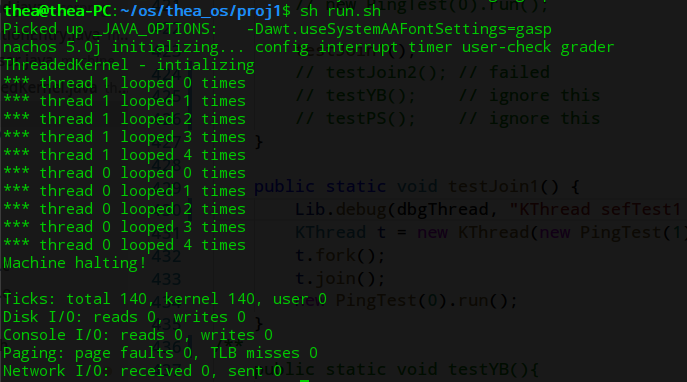
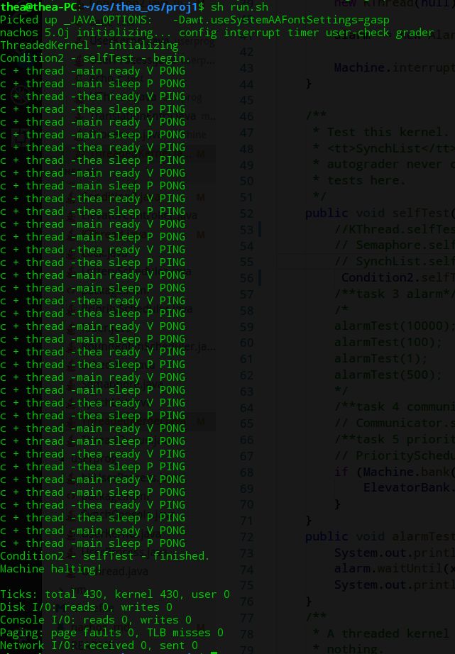
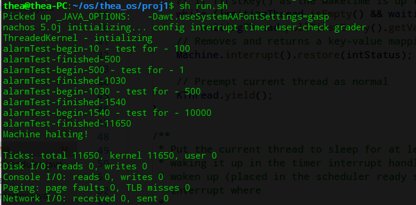
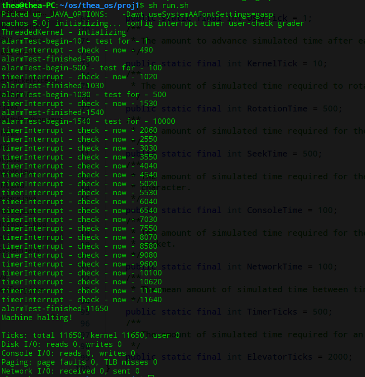
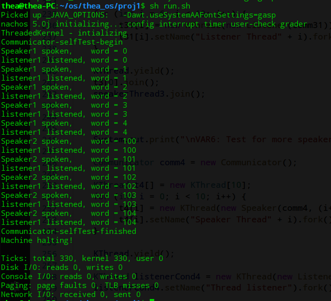
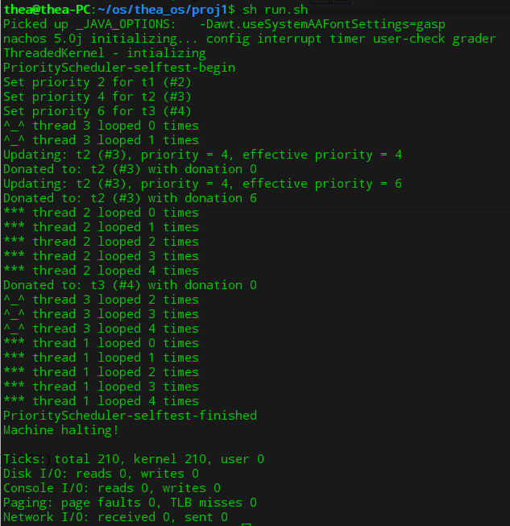
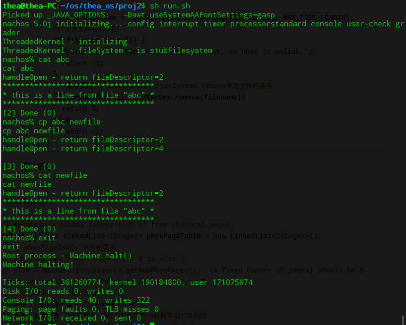
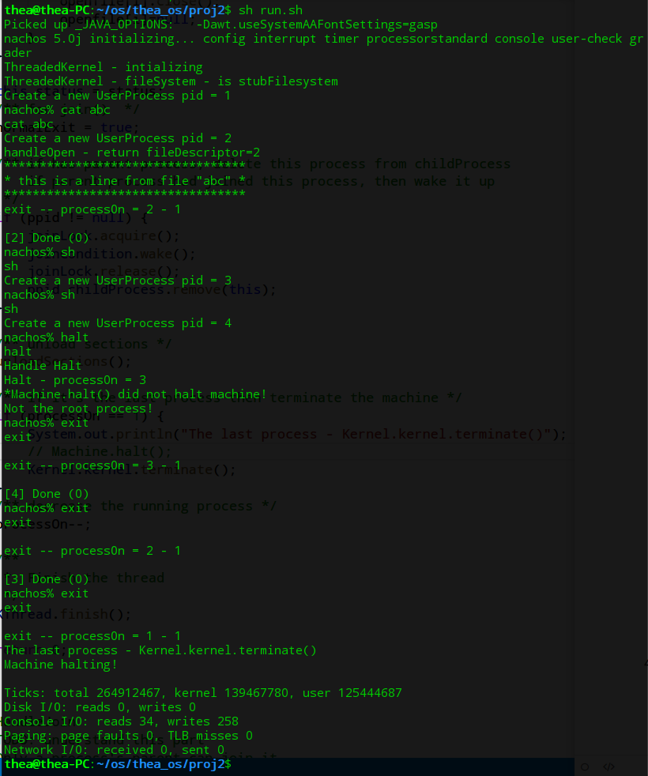
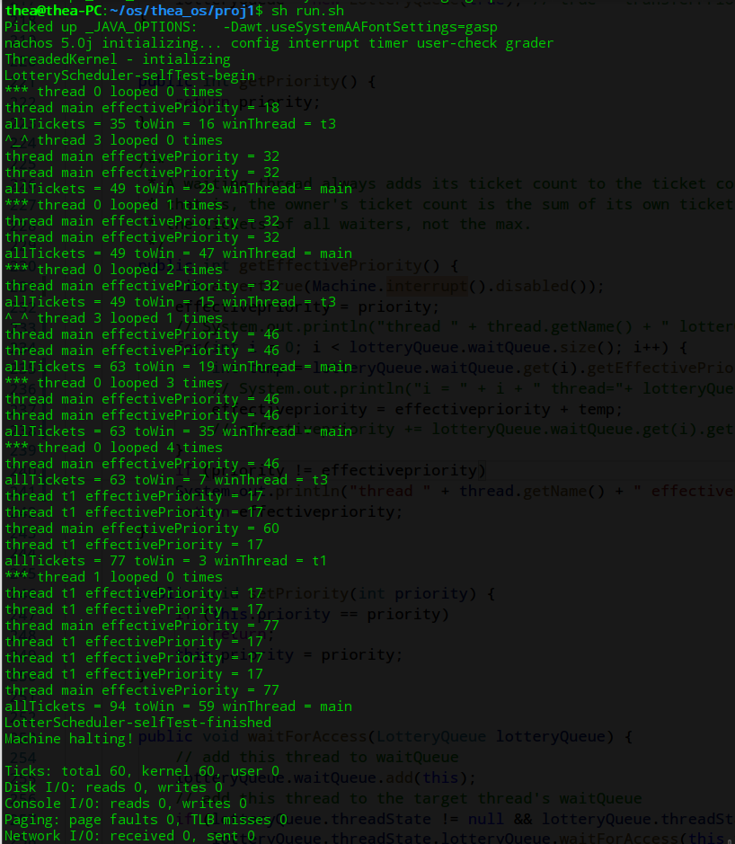

<h1><center>操作系统课程设计报告</center></h1>


<h3><center>目录</h3></center>

[TOC]


##阅读向导和源码

<!--阅读源码的部分比较长，分解到各个项目中-->

###1. 下载和配置

- 下载 nachos java版, 解压到自定义的文件目录；
- 下载 jdk , 采用open-jdk-1.8 ；
- 下载 MIPS Cross-compilers 并配置环境变量；
- 环境：Deepin 15.5 , 由于配置不成功，直接输入命令 java nachos.machine.Machine $* 运行nachos ，或者将该命令存入.sh文件，运行.sh来执行程序。
- 说明：为避免出现乱码(考虑编译环境不同)，程序中采用英文注释。在报告中引用的关键部分代码添加了中文注释。为加强可读性，删去引用代码中调试输出等不太关键的部分。
- 用git管理代码, 项目地址 [thea_os](https://github.com/wx1900/thea_os)

<!--由于配置nachos失败，直接执行上述操作启动程序-->

###2. Nachos 简介

- Nachos 是一个教学用的操作系统，包括一个真实的操作系统的许多方面，线程，中断系统，虚拟内存，由中断驱动的I/O，网络接口，计时器，MIPS处理器等．
- 基于Java实现的Nachos在JVM之上，模拟了一个计算机的硬件系统包括CPU、中断控制器、定时器、网卡、内存、文件系统等. 然后模拟了一个在这些硬件之上运行的操作系统。


- Nachos的历史
  - Originally created at Berkeley in 1992 in C++ By Wayne A. Christopher, Steven J. Procter, and Tomas E. Anderson
  - Rewritten in Java by Daniel Hettena.

###3. Nachos 工作原理

- 启动过程：

  - 启动nachos.machine.Machine.main, Machine.main 
  - 初始化设备：中断控制器，计时器，MIPS处理器，控制台，文件系统．
  - 把控制权交给AutoGrader.  AutoGrader 会创建一个内核，并启动它．

  ```java
  // nachos.machine.Machine.main
  // 处理nachos的命令行参数
  processArgs(); 
  /** configFileName是目录proj1, 或proj2 中的配置文件nachos.conf 读nachos.conf 的内容到名为machine.Config类创建的hash表中，供createDevices()使用 */
  Config.load(nachos.confg);
  //根据Config.load(configFileName)中读入的nachos.conf的参数构造相应的模拟设备
  createDevices();
  /** 利用java类的反射(reflection)机制检查相应类及方法的完整性, 类似于操作系统加载时对要加载的模块进行检查*/
  checkUserClasses();
  new TCB().start(new Runnable() {
    public void run() { autoGrader.start(privilege); }
  });
  ```

  ```java
  //autoGrader.start()
  kernel = (Kernel) Lib.constructObject(Config.getString("Kernel.kernel"));
  kernel.initialize(args);　//初始化Nachos,创建就绪队列，创建主线程及idle
  run();
  //**************************************************************************
  // 程序的执行过程就是，selfTest(), run(), terminate()
  // 我们可以把测试程序放在 selfTest() 里面
  void run() {
    kernel.selfTest();
    kernel.run();
    kernel.terminate();
  }
  ```

  对于proj1 Kernel.kernel = nachos.threads.ThreadedKernel ，所以我们可以把测试代码写在 ThreadedKernel 的 selfTest() 里面; 对于proj2 可以在UserKernel 的 selfTest()里面写测试

- nachos 配置文件

  - proj1 nachos.conf

    ```c
    Machine.stubFileSystem = false  #是否加载文件系统
    Machine.processor = false       #是否加载处理器
    Machine.console = false        
    Machine.disk = false
    Machine.bank = false
    Machine.networkLink = false
    ElevatorBank.allowElevatorGUI = true
    NachosSecurityManager.fullySecure = false
    ThreadedKernel.scheduler = nachos.threads.PriorityScheduler #nachos.threads.RoundRobinScheduler  #线程调度
    Kernel.kernel = nachos.threads.ThreadedKernel #内核
    ```

  - proj2 nachos.conf

    ```c
    Machine.stubFileSystem = true   #是否加载文件系统
    Machine.processor = true        #是否加载处理器
    Machine.console = true          #是否加载控制台
    Machine.disk = false
    Machine.bank = false
    Machine.networkLink = false
    Processor.usingTLB = false
    Processor.numPhysPages = 64
    ElevatorBank.allowElevatorGUI = false
    NachosSecurityManager.fullySecure = false
    ThreadedKernel.scheduler = nachos.threads.LotteryScheduler  #nachos.threads.RoundRobinScheduler #采用什么线程调度
    Kernel.shellProgram = sh.coff #halt.coff
    Kernel.processClassName = nachos.userprog.UserProcess #创建用户进程
    Kernel.kernel = nachos.userprog.UserKernel #创建用户内核
    ```

###4. Nachos 重点类概述

####4.1 nachos.machine.Machine

- 启动系统，并提供对各种硬件设备的访问
  - Machine.interrupt()
  - Machine.timer()
  - Machine.console()
  - Machine.networkLink()

####4.2 nachos.machine.Interrupt 

- 启动硬件中断，管理一个事件队列
- 时钟:  一个时钟周期执行MIPS指令，10个时钟周期重新启用中断
- 每个时钟周期之后，中断控制器检查待处理的中断，并运行它们
- 调用设备事件处理器，而不是软件中断处理程序
- 所有的硬件设备都依赖于中断，它们没有单独的线程
- 实现所有的方法，让硬件仿真设备可访问
  - scheduler() takes a time, handler
  - tick() takes a boolean(1 or 10 ticks)
  - checkIfDue() invokes due interrupts
  - enable()
  - disable()

####4.3 nachos.machine.Timer

- 硬件设备约每 500 时钟周期引起一次中断
- 提供抢占操作
- 重要的方法
  - getTImer() 返回经过了多少时钟周期
  - setInterruptHandler() tells the timer what to do when it goes off

####4.4 nachos.machine.Serial Console

- 控制台, 读写字符
- 包含的方法
  - readByte() 返回单个字符(或者-1)
  - writeByte() 读单个字符
  - setInterruptHandlers() 通知控制台它接收了数据或者结束发送数据后调用谁
- machine/StandardConsole.java 
  - StadardConsole 实现 SerialConsole 的接口
  - 利用java的System.in与System.out模拟了一个nachos控制台，模拟系统的键盘输入和文本输出

####4.5 nachos.machine.Kernel

- nachos.machine.Kernel 是一个抽象类，由ThreadedKernel 和 UserKernel 继承 
- 包含的方法
  - initialize() 初始化内核
  - selfTest() 运行测试程序
  - run() 运行用户代码(proj1中没有，proj2中有)
  - terminate() 终止，不再返回

####4.6 nachos.threads

- 所有的Nachos线程都是nachos.thread.KThread(或子类)的实例
- KThread 有5个状态
  - New, Ready, Running, Blocked, Finished


- 一个KThread对象代表一个Nachos线程
  - 线程的创建KThread.fork()
  - 线程的就绪KThread.ready()
  - 线程的睡眠KThread.sleep()
  - 线程的状态与转换
  - 线程的上下文切换
- Nachos线程深入理解
  - KThread对象
  - 与KThread 对象对应的TCB对象
  - 每个TCB对应一个JVM Thread对象
  - 约束关系
    - KThread.tcb -> TCB.javaThread->java Thread (new Thread(new Runnable))
  - 线程的上述操作是在KThread对应的TCB中，通过java的相应操作具体实现的

####4.7 nachos.userprog

- 一个Kthread对象对应一个Nachos核心线程
- 一个UserProcess对象对应一个Nachos用户进程
- 一个Uthread对象对应一个Nachos用户线程
- UserProcess实现将用户程序从文件系统加载到该用户进程，并在进程中创建一个用户线程以执行用户程序的代码，同时为用户提供系统调用等服务
- machine.Processor类模拟了nachos的CPU,以及CPU执行MIPS指令的过程

#### 4.8 File System

- machine/FileSystem.java  
  - file system
- machine/OpenFile.java
  - a nachos file(opened), 类似于java的File
- machine/StubFileSystem.java
  - 对OpenFile, FileSystem 方法的具体实现
  - 文件的open() 是基于java的RandomAccessFile实现的，其余的read, write, close等都是基于java的File类实现的．

###5. Nachos 命令行参数

- -d <debug flags> 
  - enable some debug flags, e.g. -d ti
  - c: prints process loading information (COFF)
  - i: HW interrupt controller info
  - p: processor info
  - m: MIPS disassembly
  - M: more MIPS disassembly
  - t: thread info
  - a: process info
- -h
  - print this help message
- -m <pages>
  - Specify how many physical pages of memory to simulate
- -s <seed>
  - Specify the seed for the random number generator
- -z
  - print the copyright message
- -x <program>
  - Specify a program that UserKernel.run() should execute, instead of the value of the configuration variable Kernel.shellProgram


##Proj1

<!--换一个引用-->

> The first step is to read and understand the partial thread system we have written for you. This thread system implements thread fork, thread completion, and semaphores for synchronization. It also provides locks and condition variables built on top of semaphores.
>
> 第一步是阅读和理解我们为你写的部分线程系统。 这个线程系统实现了线程分叉，线程完成和信号量的同步。 它还提供了基于信号量构建的锁和条件变量。

###1.实现 KThread.join()

> (5%, 5 lines) Implement `KThread.join()`. Note that another thread does not have to call `join()`, but if it is called, it must be called only once. The result of calling `join()` a second time on the same thread is undefined, even if the second caller is a different thread than the first caller. A thread must finish executing normally whether or not it is joined.
>
> (5％）实现`KThread.join()`。 请注意，另一个线程不是必须调用join()，但是如果它被调用，它只能被调用一次。 即使第二个调用方是与第一个调用方不同的线程，第二个调用join() 的结果也是未定义的。 无论是否被join，一个线程都必须正常执行。

####题目分析

- t.join()的作用是等待调用此方法的线程(t)执行完(Wait for this thread to die)．
- join()函数只能被调用一次，第二次调用未定义．
- join()结束时唤醒在等待队列中的所有线程

####方法及代码

需要修改join(), 使得当前线程加入调用线程的join队列，同时使当前线程睡眠；还需要修改finish()在线程结束后，检查join队列上是否有线程，并唤醒所有在队列上阻塞的线程。

- 修改finish()

  ```java
  // 当前线程结束，唤醒等待队列上所有被阻塞的线程
  public static void finish() {
          Lib.debug(dbgThread, "Finishing thread: " + currentThread.toString());
          Machine.interrupt().disable();
          //---------------------------------------------------------------------
          // when currentThread finished, threads of its joinQueue start execute 
          ThreadQueue currentJoinQueue = currentThread.joinQueue; 
          if(currentJoinQueue != null) {
              KThread thread = currentJoinQueue.nextThread();
              while(thread!=null) {
                  thread.ready(); // 唤醒等待队列上所有被阻塞的线程
                  thread = currentJoinQueue.nextThread();
              }
          }
          //---------------------------------------------------------------------
          Machine.autoGrader().finishingCurrentThread();
          Lib.assertTrue(toBeDestroyed == null);
          toBeDestroyed = currentThread;
          currentThread.status = statusFinished;
          sleep(); //终止的线程睡眠，等待撤销；同时引起线程调度
      }
  ```

- 修改join()

  ```java
  /**
   * 创建一个joinQueue, 把当前线程加入到调用线程(this)的joinQueue中，当前线程睡眠
   */
  public void join() {
          Lib.debug(dbgThread, "Joining to thread: " + toString());
          Lib.assertTrue(this != currentThread);
    //---------------------------------------------------------------------------
          boolean intStatus = Machine.interrupt().disable();//系统关中断
          if(this.joinQueue == null) {
              this.joinQueue = ThreadedKernel.scheduler.newThreadQueue(false);
              this.joinQueue.acquire(this);
          }
          if(currentThread != this && status != statusFinished) {
              this.joinQueue.waitForAccess(currentThread);
              currentThread.sleep();//当前线程等待被调用线程结束
          }
          Machine.interrupt().restore(intStatus);
    //---------------------------------------------------------------------------
      }
  ```

#### 测试及结果

在 KThread.selfTest() 中添加 testJoin1()

在 nachos/proj1 下执行 sh run.sh (即: java nachos.machine.Machine $*)

- 测试代码

```java
public static void testJoin1() {
        Lib.debug(dbgThread, "KThread sefTest1 start");
        KThread t = new KThread(new PingTest(1)).setName("t");
        t.fork();
        t.join();
        new PingTest(0).run();
}
```

- 测试结果

  如下图结果所示，main线程等待t线程执行完之后再执行，完成了 t.join().



> 参考：操作系统PPT

###2.实现条件变量

>  (5%, 20 lines) Implement condition variables directly, by using interrupt enable and disable to provide atomicity. We have provided a sample implementation that uses semaphores; your job is to provide an equivalent implementation without directly using semaphores (you may of course still use locks, even though they indirectly use semaphores). Once you are done, you will have two alternative implementations that provide the exact same functionality. Your second implementation of condition variables must reside in class `nachos.threads.Condition2`.
>
>  (5%)直接实现条件变量，通过使用中断启用和禁用来提供原子性。 我们提供了一个使用信号量的示例实现; 你的工作是提供一个没有直接使用信号量的等价的实现（你当然可以使用锁，即使它们间接使用信号量）。 一旦你完成了，你将有两个可供选择的实现提供完全相同的功能。 条件变量的第二个实现必须驻留在类nachos.threads.Condition2中。

####题目分析

- 条件变量(Condition) 为一个线程暂停执行提供了一种方法，直到直到另一个线程通知现在某些状态条件成立为止．
- 由于对共享状态信息的访问发生在不同的线程中，因此必须对其进行保护，以便某种形式的锁与条件相关联．
- 它会自动释放关联的锁并暂停当前线程．

####方法及代码

- 变量声明

  ```java
  private int value;
  private String name;
  private Lock conditionLock;
  private ThreadQueue waitQueue =  ThreadedKernel.scheduler.newThreadQueue(false);
  private LinkedList<Condition2> waitQueue_1;
  ```

- sleep() - 在条件变量控制下，sleep()自动释放

  ```java
  public void sleep() {
          Lib.assertTrue(conditionLock.isHeldByCurrentThread());
          
          //　添加到等待队列
          Lock lock1 = new Lock();
          Condition2 waiter = new Condition2(lock1);
          waitQueue_1.add(waiter);

          conditionLock.release();
          waiter.P();　// 调用KThread.sleep()使当前线程睡眠
          conditionLock.acquire();
      }
  ```

- wake() - 唤醒等待队列中第一个线程

  ```java
  public void wake() {
          Lib.assertTrue(conditionLock.isHeldByCurrentThread());
          if (!waitQueue_1.isEmpty())
              (waitQueue_1.removeFirst()).V();
  }
  ```

- wakeAll() - 调用wake()，唤醒等待队列中所有的线程

  ```java
   public void wakeAll() {
          Lib.assertTrue(conditionLock.isHeldByCurrentThread());
          while (!waitQueue_1.isEmpty())
              wake();
   }
  ```

- P() - 使当前线程睡眠

  ```java
   public void P() {
          boolean intStatus = Machine.interrupt().disable();
          //　使当前线程睡眠
          if (value == 0) {
              waitQueue.waitForAccess(KThread.currentThread());
              KThread.sleep();
              System.out.println("c + thread -" + KThread.currentThread().getName() +" sleep P " + this.getSName());
          }
          else {
              value--;
          }

          Machine.interrupt().restore(intStatus);
      }
  ```

  ​

- V() - 将等待队列中的线程加入就绪队列

  ```java
   public void V() {
          boolean intStatus = Machine.interrupt().disable();
          //将等待队列中的线程加入就绪队列
          KThread thread = waitQueue.nextThread();
          if (thread != null) {
              thread.ready();
              System.out.println("c + thread -" + thread.getName() + " ready V " + this.getSName());
          }
          else {
              value++;
          }
          
          Machine.interrupt().restore(intStatus);
      }
  ```

- PingTest() - 该方法是为了便于测试

  ```java
  private static class PingTest implements Runnable {
  		PingTest(Condition2 ping, Condition2 pong) {
  			this.ping = ping; this.ping.setSName("PING");
  			this.pong = pong; this.pong.setSName("PONG");
  		}

  		public void run() {
  			for (int i=0; i<10; i++) {
  				ping.P();　// sleep
  				pong.V();  // ready 
  			}
  		}

  		private Condition2 ping;
  		private Condition2 pong;
      }
  ```

- selfTest()

  ```java
  public static void selfTest() {
          System.out.println("Condition2 - selfTest - begin.");
          
          Lock lock1 = new Lock();
          Lock lock2 = new Lock();
  		Condition2 ping = new Condition2(lock1);
  		Condition2 pong = new Condition2(lock2);

  		new KThread(new PingTest(ping, pong)).setName("thea").fork();
  		
  		// main ready 
  		// main sleep
  		for (int i=0; i<10; i++) {
  			ping.V(); // ready
  			pong.P(); // sleep
  		}

  		System.out.println("Condition2 - selfTest - finished.");
      }
  ```


####测试及结果



​

###3.实现Alarm 类

> Complete the implementation of the `Alarm` class, by implementing the `waitUntil(long x)` method. 通过waitUntil(long x)实现Alarm类．
>
> A thread calls `waitUntil` to suspend its own execution until time has advanced to **at least now + x**.一个线程通过调用 waitUntil(long x)方法将自己挂起，一直到经过 x 时间再被唤醒。
>
> This is useful for threads that operate in real-time, for example, for blinking the cursor once per second. 
>
> There is no requirement that threads start running immediately after waking up; just put them on the ready queue *in the timer interrupt handler* after they have waited for at least the right amount of time. 线程经过至少x 时间后唤醒，但不需要立刻运行，而是加入 readyqueue 中。
>
> Do not fork any additional threads to implement `waitUntil()`; **you need only modify `waitUntil()` and the timer interrupt handler.**  
>
> `waitUntil` is not limited to one thread; **any number of threads** may call it and be suspended at any one time.  `waitUntil()`不受限于任何一个线程，任何线程可以调用它实现被挂起。

####题目分析

- Alarm 类使用硬件定时器提供抢占，并允许线程挂起到某个时间．
- 定时器中断处理程序被成为机器计时器定期(大约每500时钟周期).
- 当前线程睡眠至少x时间周期，在定时器中断处理程序中将其唤醒．当现在时间(current times) >= (WaitUntil called time) + (x)时, 线程必须被唤醒（在中断产生时)．因为waitUntil()是至少x时间后唤醒，所以只需要满足睡眠时间大于x即可． 

####方法及代码

由于题目要求是至少x时间后唤醒，所以不必困扰于如何产生软中断的问题。根据参考文档(题目下列出), 借助硬件中断唤醒特定的线程。这里的硬件中断是指nachos模仿的计时器Timer, 每隔500个时钟周期引起一次中断。实现方法是创建一个等待队列，每次有线程调用waitUtil()，就把该线程加入等待队列。每次发生中断，检查队列中的线程，达到唤醒时间的，将线程加入就绪队列。这样的方法可以保证线程睡眠至少x时钟周期，因为硬件中断等原因，睡眠时间一般会比x时钟周期更长。

- timerInterrupt() - 睡眠唤醒的实现．中断发生时，遍历waitingThread, 如果有线程的等待时间达到，将该线程放入就绪队列．

  ```java
  public void timerInterrupt() {
          boolean intStatus = Machine.interrupt().disable();
          // 得到系统当前时间
          long current = Machine.timer().getTime();
          // 如果等待队列中有到达睡眠时间的县城，加入就绪队列
          while (!waitingThread.isEmpty() && waitingThread.firstKey() <= current)
              waitingThread.pollFirstEntry().getValue().ready();
          // Removes and returns a key-value mapping associated with the least key in this map, or null if the map is empty.
          Machine.interrupt().restore(intStatus);
          // Preempt current thread as normal
          KThread.yield();
      }
  ```

- waitUntil()

  ```java
   public void waitUntil(long x) {
          // for now, cheat just to get something working (busy waiting is bad)
          boolean intStatus = Machine.interrupt().disable();
          long wakeTime = Machine.timer().getTime() + x;
          // 把当前线程和其唤醒时间加入等待队列
          waitingThread.put(wakeTime, KThread.currentThread());
          // 当前线程进入睡眠状态
          KThread.sleep();
          Machine.interrupt().restore(intStatus);
      }
  ```

- 测试alarmTest()

  在 ThreadedKernel 里添加 alarmTest() 方法；

  在 ThreadedKernel 的 selfTest() 中添加 alarmTest(10) 等测试代码。

  ```java
   public void alarmTest(long x) {
          System.out.println("alarmTest-begin-"+Machine.timer().getTime()+" - test for - "+x);
          alarm.waitUntil(x);
          System.out.println("alarmTest-finished-"+Machine.timer().getTime());
   }
  ```

####测试结果



alarmTest开始的时候时钟周期是10,　可能是因为kernelTick=10



timerInterrupt 约每隔500个时钟周期产生一次，多出来的时间可能是kernelTick

> 参考：
>
> - https://github.com/viturena/nachos/blob/master/threads/Alarm.java
> - https://www.javatpoint.com/java-treemap

###4.实现Communicator类

> 题目摘要
>
> Implement synchronous send and receive of one word messages 
>
> 实现发送接受信息的同步性
>
> Implement the Communicator class with operations, void speak(int word) and int listen().`speak()` atomically waits until `listen()` is called on the same `Communicator` object, and then transfers the word over to `listen()`. Once the transfer is made, both can return. Similarly, `listen()` waits until `speak()` is called, at which point the transfer is made, and both can return (`listen()` returns the word). This means that **neither thread may return from `listen()` or `speak()` until the word transfer has been made. **
>
> speak() 以原子方式等待，直到在同一个Communicator对象上调用listen()，然后将该单词传递给listen()。 一旦转移完成，两者都可以返回。 同样，listen()等待，直到speak()被调用，在这一点上传输，并且都可以返回(listen()返回该单词)。 这意味着这两个线程都不能从listen()或者speak()直到传递完成。
>
> Your solution should work even if there are multiple `speak`ers and `listen`ers for the same `Communicator` .
>
> 即使同一个Communicator有多个歌者和听者，你的解决方案仍然可以工作.
>
> <!--歌者的翻译纯粹喜好.TB-->

####题目分析

- 使用条件变量(Condition)实现信息的发送和接收
- 信息在线程之间传递以后，返回listen() 或者 speak()
- 对于同一个Communicator可以有多个speaker和listener．

####方法及代码

- 变量定义

  ```java
     Lock lock; //只使用一个锁
     private int speakerNum;　//歌者的个数
     private int listenerNum;　//听者的个数    
     private LinkedList<Integer> words;//传递消息的链表  
     Condition listener;//　听者的条件变量
     Condition speaker;//　歌者的条件变量
  ```

- speak()

  ```java
   public void speak(int word) {
          boolean preStatus = Machine.interrupt().disable();
          // 申请锁
          lock.acquire();
          // 歌者个数加一
          speakerNum++;
         
          // 如果消息链表非空或者听者数量为0，歌者睡眠
          while (!words.isEmpty() || listenerNum == 0)
              speaker.sleep();
          // 歌者说话，将消息放进消息链表
          words.addLast(word);
          // 唤醒所有听者
          listener.wakeAll();
          
          speakerNum--;
          lock.release();
          Machine.interrupt().restore(preStatus);
   }
  ```

- listen()

  ```java
  public int listen() {
          boolean preStatus = Machine.interrupt().disable();
          lock.acquire();
          listenerNum++;
          // 如果消息队列为空，唤醒所有歌者，听者睡眠
          while (words.isEmpty()) {
              speaker.wakeAll();
              listener.sleep();
          }
          // 接收一个消息
          int word = words.removeFirst();

          listenerNum--;
          lock.release();
          Machine.interrupt().restore(preStatus);
          // 返回收到的消息
  	    return word;
   }
  ```

- Speaker 自定义类

  ```java
  private static class Speaker implements Runnable {
    private Communicator c;
    private int base = 0; //基量－用来区分不同的歌者
    
    Speaker (Communicator c, int base) {
      this.c = c;
      this.base = base;
    }

    public void run() {
      for (int i = base; i < 5+base; ++i) {
        c.speak(i);
        System.out.println(KThread.currentThread().getName() + " spoken,    word = " + i);
      }
    }
  }
  ```

- Listener 自定义类

  ```java
  private static class Listener implements Runnable {
    Listener(Communicator c) {
      this.c = c;
    }
    public void run() {
      for (int i = 0; i < 10; ++i) {
        int word = c.listen();
        System.out.println(KThread.currentThread().getName() + " listened, word = " + word);
      }
    }
    private Communicator c;
  }
  ```

- 测试 selfTest()

  ```java
  // 定义一个听者两个歌者，歌者用基数区分
  public static void selfTest() {
    System.out.println("Communicator-selfTest-begin");

    Communicator c = new Communicator();

    KThread speaker1 = new KThread(new Speaker(c, 0));
    speaker1.setName("Speaker1").fork();
    
    KThread speaker2 = new KThread(new Speaker(c, 100));
    speaker2.setName("Speaker2").fork();
   
    KThread listener1 = new KThread(new Listener(c));
    listener1.setName("listener1").fork();

    listener1.join();
    speaker1.join();
    speaker2.join();

    System.out.println("Communicator-selfTest-finished");
  }
  ```

  ​

####测试结果

在 ThreadedKernel.selfTest() 中添加 Communicator.selfTest() 

在 proj1 目录下运行

- 一个听者两个歌者(base = 0 | base = 100)



> 参考：[deep_keng](http://blog.csdn.net/deep_kang/article/category/6570538)
>
> <!--比如，测试不需要发送一段信息，只需要传递数字也可以证明传递成功，在这里只需要实现原理，发送什么样的信息是不重要的-->

###5.实现优先级调度

<!--Implement priority scheduling in Nachos by completing the PriorityScheduler class.Priority scheduling is a key building block in real-time systems. -->

<!--Note that in order to use your priority scheduler, you will need to change a line in nachos.conf  that specifies the scheduler class to use. The ThreadedKernel.scheduler  key is initially equal to achos.threads.RoundRobinScheduler. You need to change this to nachos.threads.PriorityScheduler  when you're ready to run Nachos with priority scheduling.-->

<!--Note that all scheduler classes extend the abstract class `nachos.threads.Scheduler`.-->

<!--You must implement the methods `getPriority()`, `getEffectivePriority()`, and `setPriority()`.  You may optionally also implement `increasePriority()` and `decreasePriority()` (these are not required).-->

<!--In choosing which thread to dequeue, the scheduler should always choose a thread of the highest effective priority. If multiple threads with the same highest priority are waiting, the scheduler should choose the one that has been waiting in the queue the longest. 在选择哪个线程出队时，调度器应该总是选择一个最高有效优先级的线程。 如果具有相同最高优先级的多个线程正在等待，那么调度器应该选择在队列中最长等待的那个线程。 -->

<!--An issue with priority scheduling is *priority inversion*. -->

<!--If a high priority thread needs to wait for a low priority thread (for instance, for a lock held by a low priority thread), and another high priority thread is on the ready list, then the high priority thread will never get the CPU because the low priority thread will not get any CPU time. 如果高优先级线程需要等待低优先级线程（例如，对于低优先级线程所持有的锁），并且另一个高优先级线程在就绪列表中，则高优先级线程将永远不会获得CPU，因为 低优先级的线程将不会获得任何CPU时间。-->

<!--A partial fix for this problem is to have the waiting thread *donate* its priority to the low priority thread while it is holding the lock. 这个问题的一个部分解决方案是让等待线程在持有锁的同时将其优先级捐赠给低优先级线程。-->

<!--Implement the priority scheduler so that it donates priority, where possible. Be sure to implement `Scheduler.getEffectivePriority()`, which returns the priority of a thread after taking into account all the donations it is receiving. 实施优先级调度程序，以便在可能的情况下提供优先级。 一定要实现`Scheduler.getEffectivePriority()`，它在考虑了所有正在接收的捐赠之后返回一个线程的优先级。-->

<!--Note that while solving the priority donation problem, you will find a point where you can easily calculate the effective priority for a thread, but this calculation takes a long time. To receive full credit for the design aspect of this project, you need to speed this up by caching the effective priority and only recalculating a thread's effective priority when it is possible for it to change. 请注意，在解决优先捐赠问题的同时，您会发现一个点，您可以轻松计算线程的有效优先级，但是这个计算需要很长时间。 要获得本项目设计方面的全部分数，您需要通过缓存有效优先级来加快速度，只有在有可能更改时才重新计算线程的有效优先级。-->

<!--It is important that you do not break the abstraction barriers while doing this part -- the Lock class does not need to be modified. Priority donation should be accomplished by creating a subclass of ThreadQueue that will accomplish priority donation when used with the existing Lock class, and still work correctly when used with the existing Semaphore and Condition classes. Priority should also be donated through thread joins. 在做这部分时，不要打破抽象障碍是很重要的，Lock类不需要修改。 优先级捐赠应该通过创建一个ThreadQueue的子类来完成，当与现有的Lock类一起使用时，它将完成优先捐赠，并且在与现有的Semaphore和Condition类一起使用时仍然可以正常工作。 优先级也应该通过线程连接来提供。-->

<!--Priority Donation Implementation Details:                                     1) A thread's effective priority is calculated by taking the max of the donor's and the recipient's priority. If thread A with priority 4 donates to thread B with priority 2, then thread B's effective priority is now 4. Note that thread A's priority is also still 4. A thread that donates priority to another thread does not lose any of its own priority. For these reasons, the term "priority inheritance" is in many ways a more appropriate name than the term "priority donation".           2) Priority donation is transitive. If thread A donates to thread B and then thread B donates to thread C, thread B will be donating its new effective priority (which it received from thread A) to thread C.-->

> 题目摘要：
>
> 在选择哪个线程出队时，调度器应该总是选择一个最高有效优先级的线程。 如果具有相同最高优先级的多个线程正在等待，那么调度器应该选择在队列中最长等待的那个线程。
>
> 优先捐赠实施细节：
>
> 1）一个线程的有效优先级是根据捐助者的最大值和接收者的优先级来计算的。 如果优先级为4的线程A向优先级为2的线程B进行捐赠，则线程B的有效优先级为4.请注意，线程A的优先级依然为4.向另一个线程赋予优先级的线程不会失去任何优先级。 由于这些原因，“优先继承”这个词在很多方面比“优先捐赠”这个词更加合适2）优先捐赠是传递性的。 如果线程A捐赠给线程B，然后线程B捐赠给线程C，则线程B将向线程C捐赠其新的有效优先级(从线程A收到的）。

####题目分析

- 为解决优先级反转问题，需要实现一种＂捐赠＂优先级机制 (Priority Donation, 说是Priority Inheritance更合适).
- `getEffectivePriority()` 就是为了解决 *priority inversion* 设置的，也就是说当出现一个优先级高的线程等待低优先级线程时，若存在另外的高优先级线程而导致低优先级线程永远不能执行的情况，该低优先级线程调用该函数返回它持有的锁上等待的所有线程中优先级中最高的一个赋给该低优先级,　以确保它执行．
- `PriorityThreadQueue` 类继承自 `ThreadQueue` 类，作用是按照优先级给线程排序
- 定义`ThreadState`类, 它存储一个线程的优先级，有效优先级，等待时间和等待队列．并提供计算有效优先级的方法．

####方法及代码


<!--需要好好解释-->

修改`PriorityScheduler.java`

- 变量定义

  ```java
  //　定义默认优先级，优先级下限和优先级上限
  public static final int priorityDefault = 1;
  public static final int priorityMinimum = 0;
  public static final int priorityMaximum = 7; 
  ```

- 内部类 - `ThreadState`

  - 变量定义

    ```java
    // 与该对象关联的线程
    protected KThread thread;
    //　线程的优先级
    protected int priority;
    //　线程的有效优先级- EffectivePriortyDesc 存储捐赠者，执行捐赠
    protected EffectivePriorityDesc effectivePriority = new EffectivePriorityDesc(0);
    // 该线程需要等待的线程(只有parents先执行完，该线程才能执行)
    protected HashSet<PriorityQueue> parents = new HashSet<PriorityQueue>();
    ```

  - `waitForAccess()`

    ```java
    // 当前线程需要访问被waitQueue拥有的资源 
    public void waitForAccess(PriorityQueue waitQueue) {
         parents.add(waitQueue);
    }
    ```

  - `acquire()`

    ```java
    // 当等待队列里的线程被申请时，从等待队列中移除
    public void acquire(PriorityQueue waitQueue) {
     	parents.remove(waitQueue);
    }
    ```

    - `donatePriority()`

      ```java
       public void donatePriority(DonationController q, int donation) {
       	effectivePriority.donate(q, donation);
          notifyParents();
          System.out.println("Donated to: " + thread + " with donation " + donation);
       }
      ```

  - (内部类`ThreadState`的)内部类`EffectivePriorityDesc`

    - 存储捐赠者和计算最大捐赠值, 执行捐赠

    - 变量定义

      ```java
      protected int priority, max_donation; // 优先级，最大捐献值
      protected HashMap<PriorityScheduler.DonationController, Integer> donations = new HashMap<DonationController, Integer>();　// 捐献者
      ```

    - `donate()`

      ```java
      void donate(DonationController q, int priority) {
           this.donations.put(q, priority);
           max_donation = Math.max(max_donation, priority);
      }
      ```

  - 内部类 - `DonationController`

    - 变量声明

      ```java
      // 捐赠者
      protected ThreadState target;
      // 最大优先级
      protected int maximumPriority;
      // 优先级队列
      protected java.util.PriorityQueue<PriorityQueue.ThreadWrapper> queue;
      ```

    - `setTarget()`

      ```java
      public void setTarget(ThreadState t) {
          if(target != null)
               target.retractDonatedPriority(this);
          target = t;
          target.donatePriority(this, maximumPriority);
      }
      ```

    - `resetMaximumPriority()`

      ```java
      // 重置最大捐赠值
      public void resetMaximumPriority(ThreadState t) {
        if(t.getEffectivePriority() == maximumPriority) {
          maximumPriority = priorityMinimum;
          for(PriorityQueue.ThreadWrapper w : queue)
            maximumPriority = Math.max(maximumPriority, w.state.getEffectivePriority());
        }
      }
      ```

    - `transferPriority()`

      ```java
      // 进行优先级传递
      public void transferPriority(ThreadState t) {
        maximumPriority = Math.max(t.getEffectivePriority(), maximumPriority);
        if(target != null && maximumPriority > target.getEffectivePriority()) {
          target.donatePriority(this, maximumPriority);
        }
      }
      ```

- 内部类`PriorityQueue`

  根据优先级进行排序

  - 变量定义

    ```java
    // 是否进行优先级传递
    public boolean transferPriority;
    // 优先级队列排序的ThreadWrapper
    public java.util.PriorityQueue<ThreadWrapper> queue = new java.util.PriorityQueue<ThreadWrapper>();
    // 绑定ThreadState和ThreadWrapper
    public HashMap<ThreadState, ThreadWrapper> threadStates = new HashMap<ThreadState, ThreadWrapper>();
    // 执行捐赠的操作的类
    public DonationController donationController;
    ```

    - 内部类 - `ThreadWrapper`

      封装了 `ThreadState`  和  `timeInserted` 两个属性

      实现 `Comparable` 接口, 可以比较大小

      - 变量定义

        ```java
        public ThreadState state;
        public long timeInserted;
        ```

      - `compareTo`

        ```java
        // 如果有效优先级一样，等待时间越长的线程越＂大＂;如果有效优先级不一样，优先级越大的线程越＂大＂
        public int compareTo(Object o) {
             Lib.assertTrue(o instanceof ThreadWrapper);
             ThreadWrapper s = (ThreadWrapper) o;
             return (state.getEffectivePriority() == s.state.getEffectivePriority()) ? (int)(timeInserted - s.timeInserted) : (s.state.getEffectivePriority() - state.getEffectivePriority());
        }
        ```

  - `waitForAccess()`

    ```java
    public void waitForAccess(KThread thread) {
    	Lib.assertTrue(Machine.interrupt().disabled());
        Lib.assertTrue(!threadStates.containsKey(getThreadState(thread)));
        // 把线程添加进threadStates
        threadStates.put(getThreadState(thread), new ThreadWrapper(getThreadState(thread)));
        // 把线程添加进优先级队列
    	queue.add(threadStates.get(getThreadState(thread)));
    	getThreadState(thread).waitForAccess(this);
       	if(transferPriority)
    	    donationController.transferPriority(getThreadState(thread));
    }
    ```

  - `acquire()`

    ```java
    public void acquire(KThread thread) {
    	Lib.assertTrue(Machine.interrupt().disabled());
        Lib.assertTrue(!threadStates.containsKey(getThreadState(thread)));
        getThreadState(thread).acquire(this);
        if(transferPriority)
            donationController.setTarget(getThreadState(thread));
    }
    ```

  - `pickNextThread()`

    ```java
    // queue 是优先级队列，队列头就是优先级最大的线程(或者等待时间最长的线程)
    protected ThreadState pickNextThread() {
        return queue.peek().state;
    }
    ```

####测试及结果

- 测试代码

  在 KThread 类中添加方法 testPS()

  在 KThread.selfTest() 中添加 testPS()

  ```java
  /**
   *  测试时，修改join()中的ThreadedKernel.scheduler.newThreadQueue(false);为true
   *  才能进行优先级传递(transferPriority = true)
   */
  public static void testPS(){  
          boolean intStatus = Machine.interrupt().disable();
          System.out.println("PriorityScheduler-selftest-begin");
          KThread t1 = new KThread(new PingTest(1)).setName("t1");
          KThread t2 = new KThread(new PingTest(2)).setName("t2");
          // 设置线程t1的优先级为２，线程t2的优先级为４
    		new PriorityScheduler().setPriority(t1,2);
          new PriorityScheduler().setPriority(t2,4);
          KThread t3 = new KThread(new Runnable(){
              public void run(){
                  for (int i = 0; i < 5; i++) {
                      if(i == 2) {
                          t2.join();
                      }                        
                      System.out.println("^_^ thread 3 looped "
                                 + i + " times");
                      KThread.currentThread().yield();
                  }
              }
          }).setName("t3");
    　　　// 线程t3 需要等t2执行完才能全部执行完，设置t3的优先级为６
    　　　// t3 的优先级比t2大，出现priority inversion,需要进行优先级捐赠(继承)
          new PriorityScheduler().setPriority(t3,6);
          t1.fork();
          t2.fork();
          t3.fork();
          currentThread.yield();
          System.out.println("PriorityScheduler-selftest-finished");
          Machine.interrupt().restore(intStatus);
      }
  ```

- 测试结果

  测试结果显示，t3把优先级传递给了t2



###6. 划船 TODO

## Proj2

>- Processor simulates a MIPS processor.
>- SerialConsole simulates a serial console (for keyboard input and text output).
>- FileSystem is a file system interface. To access files, use the FileSystem returned by Machine.stubFileSystem(). This file system accesses files in the test directory.

###1.实现文件系统调用

####题目分析

- 实现文件系统的相应(create, open, read, write, close and unlink).
- 用户所有的操作都不应该终止操作系统，除了执行 `halt()` 指令．
- `halt()` 必须只有根进程才可以调用，如果其他进程调用了 `halt()` , 应该忽视并立刻返回．
- 文件名最长为 `256bytes`
- 文件描述符 0 和 1 代表标准输入和标准输出．
- 你可以通过 `ThreadedKernel.fileSystem` 调用 stub filesystem .
- 每个进程可以打开16个文件．不同的进程可以用同样的文件描述符代表不同的文件．

####方法及代码

- 部分变量

  ```java
  // 被进程打开的文件，最多为16个
  OpenFile openfile[] = new OpenFile[16];
  //　文件名的最大长度 
  private static final int MAX_FILENAME_LENGTH = 256;
  //　文件的最大长度
  private static final int MAX_FILE_LENGTH = 1024;
  ```

- 初始化

  ```java
  openfile[0] = UserKernel.console.openForReading();
  openfile[1] = UserKernel.console.openForWriting();
  ```

- `findEmpty()`  - 找一个空文件描述符的方法

  ```java
  // 遍历找一个空的文件描述符，如果不存在返回 -1
  private int findEmpty ()
  {
    for(int i = 0;i < 16; i++)
    {
      if(openfile[i] == null)
        return i;
    }
    return -1;
  }
  ```

- `handleOpen()`

  ```java
  /**
   *　找一个空的文件描述符;
   *  调用 ThreadKernel.fileSystem.open() 打开文件
   ＊　把打开的文件加入openfile, 返回新的文件描述符
   */
  private int handleOpen (int fileAddress) {
  	// 从内存中读取文件名
    　String filename = readVirtualMemoryString(fileAddress,256);	
  	if(filename == null)
  		return -1;
      // 找一个空的文件描述符
  	int fileDescriptor = findEmpty();
    　// 如果没有空文件描述符返回 -1
  	if (fileDescriptor == -1) {
  		System.out.println("we are out of file descriptors.");
          return -1;
       } else {
           // 打开文件，设置参数为false表示如果文件不存在不可以创建一个新文件
           OpenFile file = ThreadedKernel.fileSystem.open(filename, false);
           if (file == null) {
               // 如果文件不存在返回-1
               System.out.println("Unable to open file: " + filename);
               return 0;
            } else {
                // 把文件加入打开的文件数组
                openfile[fileDescriptor] = file;
              　// 返回新的文件描述符
             　　return fileDescriptor;
           }   
       }
  }
  ```

- `handleCreate()`

  ```java
  /**
   * 创建一个文件，调用ThreadKernel.fileSystem
   * 如果不能创建，输出不能创建的信息
   */
  private int handleCreate(int fileAddress) {	
    String filename = readVirtualMemoryString(fileAddress,256);
    // 检查文件名是否为空
    if (filename == null || filename.length() == 0) {
      System.out.println("Invalid filename for create()");
      return -1;
    }
  　// 找一个空的文件描述符
    int fileDescriptor = findEmpty();
    if (fileDescriptor == -1) {
      // 如果没有空的文件描述符，返回 -1
      System.out.println("we are out of file descriptors.");
      return -1;
    } else {
      // 创建一个文件，即设置参数为true,如果文件不存在就可以创建一个
      final OpenFile file = ThreadedKernel.fileSystem.open(filename,true);
      // 如果创建失败，输出失败信息
      if (file == null) {
        System.out.println("Unable to create file: "+ filename);
      }
      // 把创建的文件加入openfile里
      openfile[fileDescriptor] = file;
      //　返回新的文件描述符 
      return fileDescriptor;
    }
  }
  ```

- `handleRead()`

  ```java
  /**
   *　读取对应文件中的对应长度的字符，并将它写道虚拟内存的相应地址中
   */
  private int handleRead (int fileDescriptor,int bufferAddress,int  length) {
    //　检查长度是否合理
    if (length < 0) {
      System.out.println("Count must be non-negative for read()");
      return -1;
    }
    // 检查是否为有效的文件描述符
    if (fileDescriptor < 0 || fileDescriptor >= openfile.length || openfile[fileDescriptor] == null) {
      System.out.println("Invalid file descriptor passed to read()");
      return -1;
    }
    //　新建一个缓冲区
    byte tmp[] = new byte[length];
    // 读取对应文件中对应长度的字符到缓冲区里
    int numBytesRead = openfile[fileDescriptor].read(tmp, 0, length);
    // 把缓冲区写道对应的虚拟内存地址中
    int numBytesWritten = writeVirtualMemory(bufferAddress, tmp, 0, numBytesRead);
    // 写出错，返回 -1
    if (numBytesRead != numBytesWritten) {
      System.out.println("Expected to write " + numBytesRead + " bytes into virtual memory, but actually wrote " + numBytesWritten);
      return -1;
    }
    // 返回文件读取的长度
    return numBytesRead;
  }
  ```

- `handleWrite()`

  ```java
  /**
   * 读取相应虚拟内存地址的对应长度的字符，写到文件描述符对应的文件中
   */
  private int handleWrite(int fileDescriptor,int bufferAddress,int  length) {
    // 检查长度是否合理
    if (length < 0) {
      System.out.println("Count must be non-negative for write().");
      return -1;
    }
    // 检查文件描述符是否合理
    if (fileDescriptor < 0 || fileDescriptor >= openfile.length || openfile[fileDescriptor] == null) {
      System.out.println("Invalid file descriptor passed to write()");
      return -1;
    }
  　// 打开文件描述符对应的文件
    OpenFile file = openfile[fileDescriptor];
  　// 建立缓冲区
    byte[] tmp = new byte[length];
    // 将对应位置的字符读取到缓冲区
    int numBytesToWrite = readVirtualMemory(bufferAddress, tmp);
  　//　检查读取是否成功
    if (numBytesToWrite != length) {
      System.out.println(
        "Expected to read " + length + " bytes from virtual memory, but actually wrote " + numBytesToWrite);
      return -1;
    }
  　// 将读取的内容写到对应的文件
    int writeNumber = openfile[fileDescriptor].write(tmp, 0, length);
  　// 返回写的长度
    return writeNumber;
  }
  ```

- `handleClose()`

  ```java
  // 找到文件描述符对应的文件，关闭文件即可
  private int handleClose (int fileDescriptor) {
    //　检查文件描述符是否合理
    if(fileDescriptor <0 || fileDescriptor >= MAX_OPEN_FILES_PER_PROCESS) {
      System.out.println("Invalid file descriptor passed to close()");
      return -1;
    }
    // 打开文件描述符对应的文件
    OpenFile file = openfile[fileDescriptor];
    // 查看文件是否为打开状态，不是返回 -1
    if (file == null) {
      System.out.println("There is no open file with the given file descriptors passed to close()");
      return -1;
    }
    // 将对应的文件描述符置空
    openfile[fileDescriptor] = null;
    // 关闭文件，直接调用OpenFile的方法
    file.close();
    return 0;
  }
  ```

- `handleUnlink()`

  ```java
  /**
   * 从虚拟内存的对应地址读取文件名
   *　调用ThreadedKernel.fileSystem.remove解除文件连接
   */
  private int handleUnlink (int fileAddress) {
    //　读取对应文件名
    String filename = readVirtualMemoryString(fileAddress, MAX_FILE_LENGTH);
  　// 如果文件名不存在
    if(filename == null) {
      System.out.println("File doesn't exist, no need to unlink.");
      return -1;
    }
    // 直接调用ThreadedKernel.fileSystem.remove解除文件的连接
    if(ThreadedKernel.fileSystem.remove(filename))
      return 0;
    else 
      return -1;
  }
  ```

####测试结果

显示文件名为abc的文件内容

将文件abc复制到文件newfile

显示文件名为newfile的内容



###2.实现对多道程序的支持

####题目分析

- 提出一种分配物理内存的方法，从而是内存不会出现重复使用.　我们保证进程不会分配和释放内存，也就是说你可以在进程创建时就直到它所需的内存．你可以分配一个固定数量的页给进程的栈，比如８页
  - 建议为物理内存维护一个全局链表．确保对这个链表进行同步化操作．这个链表可以让内存页表的分配不连续，提供有效分配．
  - 在进程结束时，所有该进程占有的内存要被释放．
- 修改`UserProcess.readVirtualMemory` 和 `UserProcess.writeVirtualMemory` ，这两个方法在 `kernel` 和虚拟内存空间传递数据，参与多用户进程． 
  - 你应该给每个进程维护一个从虚拟地址映射到物理地址的页表. 	`TranslationEntry` 类代表一个简单的虚拟页到物理页的转换．
  - 如果一个`COFF` 的页被标记为 `readOnly  `， ，那么 `TranslationEntry.readOnly`应该置 true．
  - 这些方法不可以抛出异常，必须总是返回传递的字符长度
- 修改 `UserProcess.loadSections()` ，使它分配它所需要的页表．

####方法及代码

- `UserKernel`

  - 相关变量描述

    ```java
    // 内存分配锁 - 保护内存互斥访问
    public static Lock allocateMemoryLock;
    // 内存页号链表 - 存储空的内存页号
    public static LinkedList<Integer> memoryLinkedList;
    ```

  - `initilize()`

    ```java
    public void initialize(String[] args) {
       // initialize the kernel
       super.initialize(args);
       // create a synchronized console -- Amazing!
       console = new SynchConsole(Machine.console());
       // set the processor's exception handler
       Machine.processor().setExceptionHandler(new Runnable() {
         public void run() { exceptionHandler(); }
       });

       // 初始化内存链表
       memoryLinkedList=new LinkedList();
       // 添加内存页号
       // 初始化时是连续的页号，但是重新分配时会打乱页的顺序
       // 也就实现了不连续分配内存．
       for(int i=0;i<Machine.processor().getNumPhysPages();i++)
         memoryLinkedList.add((Integer)i);      
       // 初始化内存分配锁，保证内存分配同步化
       allocateMemoryLock=new Lock();
    }
    ```

- `UserProcess`

  - 相关变量描述

    ```java
    /** The program being run by this process. */
    protected Coff coff;
    /** This process's page table. */
    protected TranslationEntry[] pageTable;
    /** The number of contiguous pages occupied by the program. */
    protected int numPages;
    /** The number of pages in the program's stack. */
    protected final int stackPages = 8;
    ```

  - `readVirtualMemory()`

    ```java
    // 计算物理地址,读出内存中的字符传入data
    public int readVirtualMemory (int vaddr, byte[] data, int offset, int length) 
    {
      Lib.assertTrue(offset >= 0 && length >= 0 && offset + length <= data.length);
      byte[] memory = Machine.processor().getMemory();
      if(length > (pageSize * numPages - vaddr)
         length = pageSize * numPages - vaddr;
      if(data.length - offset < length)
          length = data.length - offset;
      int transferredbyte=0;  
      do{ 
    　　　//　计算物理地址
          int pageNum = Processor.pageFromAddress(vaddr + transferredbyte);
          if(pageNum <0 || pageNum >= pageTable.length)
            return 0;    
          int pageOffset = Processor.offsetFromAddress(vaddr + transferredbyte);       int leftByte = pageSize - pageOffset;
          int amount = Math.min(leftByte, length -transferredbyte);        
          int physAddress = pageTable[pageNum].ppn * pageSize + pageOffset;
          // 把数据从内存传入data
          System.arraycopy(memory, physAddress, data, offset + transferredbyte, amount);
          transferredbyte = transferredbyte + amount;
        } while(transferredbyte < length);
        return transferredbyte;
      }
    ```

  - `writeVirtualMemory()`

    ```java
    // 计算物理内存，把data中的内容写入内存的物理地址，返回传递的字符串个数．
    public int writeVirtualMemory(int vaddr, byte[] data, int offset, int length) {
      Lib.assertTrue(offset >= 0 && length >= 0 && offset + length <= data.length);
      byte[] memory = Machine.processor().getMemory();
      if(length > (pageSize * numPages - vaddr))
        length = pageSize * numPages - vaddr;
      if(data.length - offset < length)
        length = data.length - offset;
      int transferredbyte = 0;
      do{
        // 计算物理地址
        int pageNum = Processor.pageFromAddress(vaddr + transferredbyte);
        if(pageNum < 0 || pageNum >= pageTable.length)
          return 0;
        int pageOffset = Processor.offsetFromAddress(vaddr + transferredbyte);		int leftByte = pageSize - pageOffset;
        int amount = Math.min(leftByte, length - transferredbyte);
        int physAddress = pageTable[pageNum].ppn * pageSize + pageOffset;
        // 把data中的内容写入内存的物理地址
        System.arraycopy(data, offset + transferredbyte, memory, physAddress, amount);
        transferredbyte = transferredbyte + amount;	
      } while(transferredbyte < length);
      return transferredbyte;
    }
    ```

  - `loadSections()`

    ```java
    /**
     * 为这个进程分配内存，把 coff 加载进内存．
     * 如果成功返回，进程正常执行; 反之进程初始化失败
     */
    protected boolean loadSections() {
      // 申请内存分配锁
      UserKernel.allocateMemoryLock.acquire();
    　// 如果页的数量超过内存页表规定的数量，关闭coff文件
      if (numPages > UserKernel.memoryLinkedList.size()) {
        coff.close();
        Lib.debug(dbgProcess, "\tinsufficient physical memory");
        UserKernel.allocateMemoryLock.release();
        return false;
      }
      // 初始化页表
      pageTable = new TranslationEntry[numPages];
      for (int i = 0; i < numPages; i++) {
        int nextPage = UserKernel.memoryLinkedList.remove();			
        pageTable[i] = new TranslationEntry(i, nextPage, true, false, false, false);
      }
      // 释放内存分配锁
      UserKernel.allocateMemoryLock.release();
      for (int s = 0; s < coff.getNumSections(); s++) {
        CoffSection section = coff.getSection(s);
        Lib.debug(dbgProcess, "\tinitializing " + section.getName()
                  + " section (" + section.getLength() + " pages)");
        for (int i = 0; i < section.getLength(); i++) {
          int vpn = section.getFirstVPN() + i;
          pageTable[vpn].readOnly = section.isReadOnly();
          // 加载物理地址对应的页表
          section.loadPage(i, pageTable[vpn].ppn);   
        }
      }
      return true;
    }
    ```

  - `unloadSection()`

    ```java
    // 释放被loadSection分配的内存
    protected void unloadSections() {
      // 申请内存分配锁
      UserKernel.allocateMemoryLock.acquire();
      for(int i = 0; i < numPages; i++) {
        UserKernel.memoryLinkedList.add(pageTable[i].ppn);
        pageTable[i]=null;
      }
    　//　释放内存分配锁
      UserKernel.allocateMemoryLock.release();
    }
    ```

####测试及结果

- 无直接测试结果，程序修改后运行正常

###3.实现系统调用

####题目分析

- 实现系统调用( `exec`, `join` , `exit` )
- 所有的地址传送都是虚拟地址，你需要用 `readVirtualMemory` 和 `readVirtualMemoryString` 来实现内存在 `kernel` 和进程之间的传递．
- 子进程的状态对进程来说不可见．这说明父进程和子进程不直接共享内存或文件描述符．应注意这两个进程可以打开同样的文件．
- 和 `KThread.join()` 不同，只有一个进程的父进程可以调用 `join()` ; 比如：A执行Ｂ，B执行Ｃ，A不允许调用`C.join()` , 但是Ｂ可以．
- `jion` 用 `process ID` 来唯一标识进程．进程号应该是一个全局唯一的正整数，在每个进程创建的时候就赋给进程(尽管，进程号只有在 `join` 中用到). 定义一个进程计数器来当作进程号，不需要考虑溢出．
- 当一个进程调用 `exit()` 时，该进程的线程应该立即终止，并且该线程应该清理所有的状态（释放内存，关闭打开的文件）．当一个进程不正常退出时，也执行上述清理过程．
- 退出进程的退出状态应该传递给父进程，以避免父进程调用 `join()` ．
- 最后一个进程调用 `exit()` 应该调用 `Kernel.kernel.terminate()` 导致系统中止.(注意，只有根进程才可以调用 `halt()` , 但是最后一个退出的进程应该直接调用 `Kernel.kernel.terminate()`)

####方法及代码

- 相关变量描述

  ```java
  // 进程状态
  public int status = 0;
  // 退出状态
  public boolean normalExit = false;
  // 与该进程相关的线程
  public UThread thread = null;
  // 进程号
  private int pid = 0;
  // 父进程
  public UserProcess  ppid = null;
  // 子进程的链表
  public LinkedList<UserProcess> childProcess = new LinkedList();
  // 进程计数器
  private static int processCounter = 0;
  //　正在执行的进程数目
  private static int processOn = 0;
  /** join() wait lock */
  private Lock joinLock = new Lock();
  /** join() condition */
  private Condition joinCondition = new Condition(joinLock);
  ```

- `handleExec()`

  ```java
  /**
   * 创建一个子进程执行制定的文件的操作，注意文件创建失败时对进程计数器的操作．
   */
  private int handleExec (int fileAddress, int argc, int argvAddress) {
    // 读取文件名
    String filename = readVirtualMemoryString(fileAddress, MAX_FILENAME_LENGTH);
    if(filename == null || argc < 0 || argvAddress < 0 || argvAddress > numPages * pageSize)
      return -1;
    /** get args */
    String[] args = new String[argc];
    for (int i = 0; i < argc; i++) {
      byte[] argsAddress = new byte[4];
      if(readVirtualMemory(argvAddress + i * 4, argsAddress) > 0)
        args[i] = readVirtualMemoryString(Lib.bytesToInt(argsAddress, 0), 256);
    }
  　// 创建一个子线程执行 Coff 文件
    UserProcess process = UserProcess.newUserProcess();
    if(! process.execute(filename, args)) {
      // 如果执行失败，进程计数器要-1, 否则出现混乱
      processCounter--;
      processOn--;
      return -1;
    }
    // 把当前进程赋给创建进程的父进程
    process.ppid = this;
    // 把创建的进程添加到子进程链表
    childProcess.add(process);
    return process.pid;
  }
  ```

- `handleJoin()`

  ```java
  // 只有一个进程的父进程可以调用join()
  private int  handleJoin (int pid, int statusAddress) { 
    UserProcess process = null;	  
    /** 检查传入的进程是不是它的子进程*/
    for(int i = 0;i < childProcess.size(); i++) {
      if(pid == childProcess.get(i).pid) { 
        process = childProcess.get(i);
        break;
      }
    } 
    /** 如果子进程不存在，或者没有对应的线程，返回-1 */
    if(process == null||process.thread == null) {
      System.out.println("Join error");
      return -1;
    }
    // 申请join锁
    process.joinLock.acquire();
    /** 该进程睡眠*/
    process.joinCondition.sleep();
    /** 释放join锁 */
    process.joinLock.release();
    byte[] childstat = new byte[4];
    /** 得到子进程的状态 */
    Lib.bytesFromInt(childstat, 0, process.status);
    /** 把子进程的状态写到对应内存地址 */
    int numWriteByte = writeVirtualMemory(statusAddress, childstat);
    /** 如果子进程正常退出，状态也写入成功，返回１ */
    if(process.normalExit && numWriteByte == 4)
      return 1;
    return 0;
  }
  ```

- `handleExit()`

  ```java
  // 关闭一系列的文件，处理jion()相关的部分，如果是最后一个进程，终止
  private int handleExit (int status) {
    /** 关闭 coff 文件 */
    coff.close();
    /** 关闭该进程打开的所有文件 */
    for (int i = 0; i < 16; i++) {
      if(openfile[i] != null)	{
        openfile[i].close();
        openfile[i]=null;
      }
    }
    this.status = status;
    /** for join()  */
    normalExit = true;
    // 如果有父进程，从父进程的childProcess链表中删去该进程
    // 如果父进程调用了，此进程的join, 唤醒父进程
    if (ppid != null) {
      joinLock.acquire();
      joinCondition.wake();
      joinLock.release();
      ppid.childProcess.remove(this);	
    }
    /** unload sections */
    unloadSections();
    /** if it's the last process then terminate the machine */
    if (processOn == 1) {
      System.out.println("The last process - Kernel.kernel.terminate()");
      Kernel.kernel.terminate();
    }	
    /** decrease the running process */
    processOn--;
  　// 终止线程, 线程是进程的执行单元，要最后才终止线程
    KThread.finish();
    return 0;
  }
  ```

  ​

####测试结果

进入 `shell` 之前，打印创建进程的信息 `Create a new UserProcess pid = 1` ,　用一个进程运行　 `sh.coff`

`%cat abc` 创建一个进程执行 `cat.coff` , 执行完后退出, 打印退出信息，`exit -- processOn = 2 - 1` 表示，退出时进程减一．

输入 `sh`　创建子进程，子进程调用 `halt` 返回出错信息，不抛出异常．

子进程调用 `exit` 正常退出．

<!--没有对join进行测试-->



###4.实现彩票调度

####题目分析

- 处于等待的线程传递彩票给它在等待的线程．一个线程的彩票是它自己的彩票和所有等待它执行完的线程的彩票之和．
- 系统中有百万张彩票，也应该可以应对．
- `LotterScheduler.increasePriority()` 和 `LotterSchedulre.decreasePriority()` 被调用时，分别执行优先级加一和减一
- 系统中的彩票数量最大不超过 `Integer.MAX_VALUE` , 一个线程的最大优先级也是 `Integer.MAX_VALUE` 而不是７．

####方法及代码

处于等待的线程将彩票传递给它在等待的线程，也就是，如果线程A拥有彩票20，线程B拥有彩票12，线程A需要等待线程B执行。那么线程B的彩票就是线程A的彩票和线程B的彩票的和32。

方法是，在现有线程的最大彩票数的区间内，随机产生一个值，然后将线程队列中对应到这个值的线程选做下一个线程。比如，有线程 A 拥有彩票10，线程B拥有彩票20，线程C拥有彩票30，总彩票数为60，产生一个0~60的随机数，比如32，则对应到线程C。线程拥有的彩票越多，中奖率越高。具体实现看下面的代码。

类 `LotteryScheduler`

- 变量描述

  ```java
  public static final int priorityDefault = 1;    
  public static final int priorityMinimum = 0;    	
  public static final int priorityMaximum = Integer.MAX_VALUE;
  ```

- 内部类 - `ThreadState`

  - 变量描述

    ```java
    protected KThread thread; //　相关的线程	
    protected int priority;　// 优先级
    protected int effectivepriority;　// 有效优先级
    protected LotteryQueue lotteryQueue;　// 选出下一个线程的类
    ```

  - `getEffectivePriority()`

    ```java
    // 一个线程的优先级是自身和所有waiter的有效优先级的和
    public int getEffectivePriority() {			
    	effectivepriority = priority;	
    	for(int i = 0; i < lotteryQueue.waitQueue.size(); i++) {
           effectivepriority += lotteryQueue.waitQueue.get(i).getEffectivePriority();
        }
      return effectivepriority;
    }
    ```

- 内部类 - `LotteryQueue`

  - 变量描述

    ```java
    public boolean transferPriority;//是否进行优先级传递
    // 等待线程的链表
    public LinkedList<ThreadState> waitQueue = new LinkedList<ThreadState>();
    public ThreadState threadState = null;
    private int index;
    ```

  - `nextThread()`

    ```java
    public KThread nextThread() {
      Lib.assertTrue(Machine.interrupt().disabled());
      if(waitQueue.isEmpty())
        return null;
      int allTickets=0;
      // 计算等待队列中所有的彩票总和
      for (int i = 0; i < waitQueue.size(); i++) {  
        ThreadState thread = waitQueue.get(i);
        allTickets = allTickets + thread.getEffectivePriority();
      }	
      // 在彩票总和区间内取一个随机数
      int toWin = Lib.random(allTickets + 1);
      int nowTickets = 0;
      KThread winThread = null;
      ThreadState threadState = null;
      // 如果当前线程的彩票加上之前所有线程的彩票数大于等于产生的随机数，当前线程中奖
      // 线程拥有的彩票数越多，中奖几率越大
      for (int i = 0; i < waitQueue.size(); i++) {  
        threadState = waitQueue.get(i);
        nowTickets = nowTickets + threadState.getEffectivePriority();
        if (nowTickets >= toWin) {
          winThread = threadState.thread;
          break;
        }
      }
      if(winThread != null)
        waitQueue.remove(threadState);
      return winThread;	    
    }
    ```

####测试与结果

- 测试代码

  为了方便测试，将测试在 proj1 进行．修改 proj1 的配置文件

  ` ThreadedKernel.scheduler = nachos.threads.LotteryScheduler`

  测试写在 `KThread.java` 中，为了便于创建线程．

  ```java
  // 设t1的优先级为３，t3的优先级为14
  // t3在执行的过程中调用t1.join()
  public static void testLS() {
    boolean intStatus = Machine.interrupt().disable();
    System.out.println("LotteryScheduler-selfTest-begin");
    KThread t1 = new KThread(new PingTest(1)).setName("t1");
    new LotteryScheduler().setPriority(t1, 3);
    t1.fork();
    KThread t3 = new KThread(new Runnable(){
      public void run(){
        for (int i = 0; i < 5; i++) {
          if(i == 2) {
            t1.join();
          }                        
          System.out.println("^_^ thread 3 looped "
                             + i + " times");
          KThread.currentThread().yield();
        }
      }
    }).setName("t3");
    t3.fork();
    new LotteryScheduler().setPriority(t3, 14);
    new PingTest(0).run();
    System.out.println("LotterScheduler-selfTest-finished");
    Machine.interrupt().restore(intStatus);
  }
  ```

  ​

- 测试结果

  在 `t3` 执行了２次，调用 `t1.join()` 后，`t1` 的有效优先级变成 3+14 = 17, 即 `t1` 和 `t3` 的优先级和． 




## 总结

###课设成果总结

这次课程设是完善nachos操作系统，完成 proj1 和 proj2.

Proj1 主要工作是线程方面。实现了join()方法，实现一个条件变量，实现Alarm的waitUtil()，实现听者歌者，实现优先级调度。

Proj2 主要工作包括，完成文件系统调用，实现handleRead()等方法；完成对多道程序的支持，实现内存的分配和虚拟地址与物理地址的转换；完成系统调用，实现handleExit()等方法；完成彩票调度。

### 经验与收获

这次课设开始，最难的是入门。最好是跟着老师把boot的过程走一遍，然后自己试着读代码。可以先跟着PPT完成第一个小实验，熟悉nachos的一些类。我对java的线程掌握的不好，需要看书补充这部分的知识。在完成时，参考网上的一些博客也非常有用，比如在Alarm这个类，一开始没有头绪，看了别人写的才了解到要用硬件中断来完成这个任务，因为nachos没有软件中断；在歌者听者的部分，参考学长写的博客，知道了可以传输最简单的信息数字，这个其实没有什么影响，也可以传别的，但一开始写代码时，一些地方的化简会感觉清晰很多。


